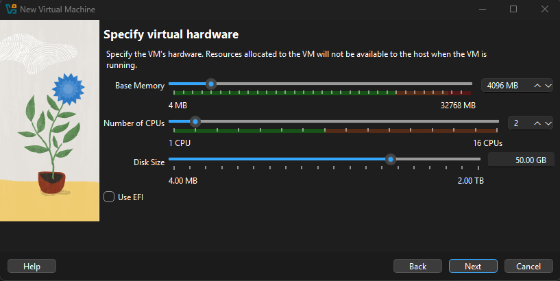
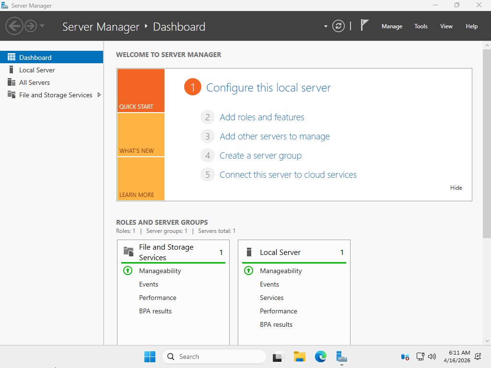
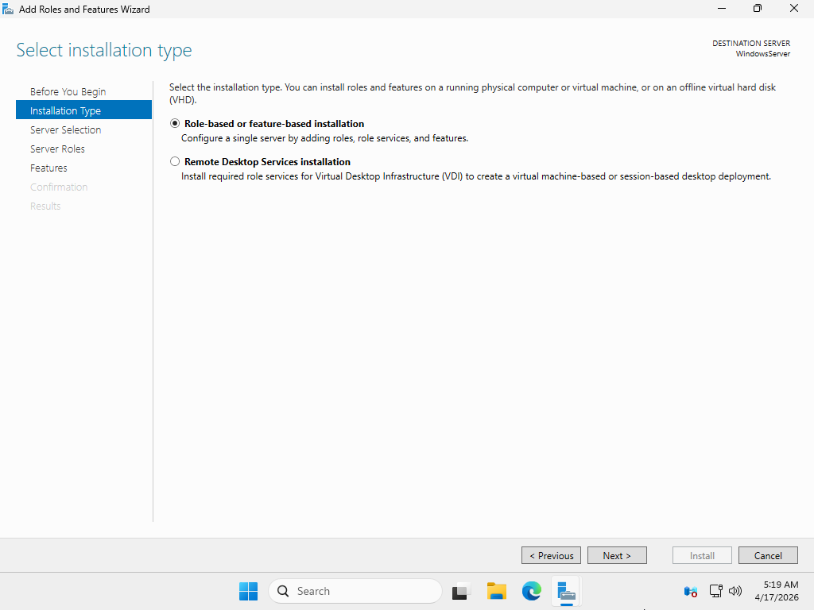
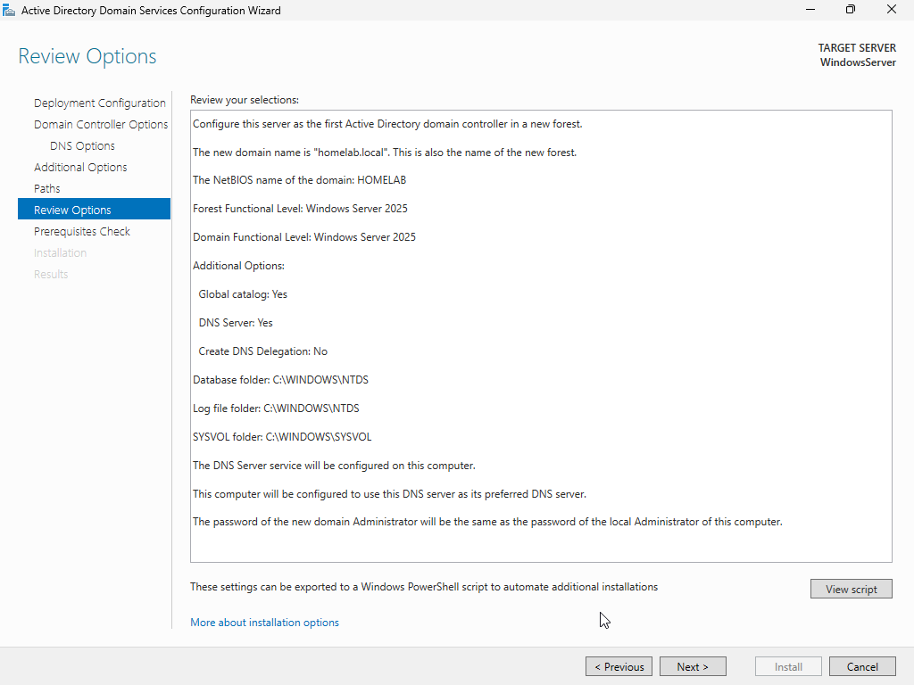
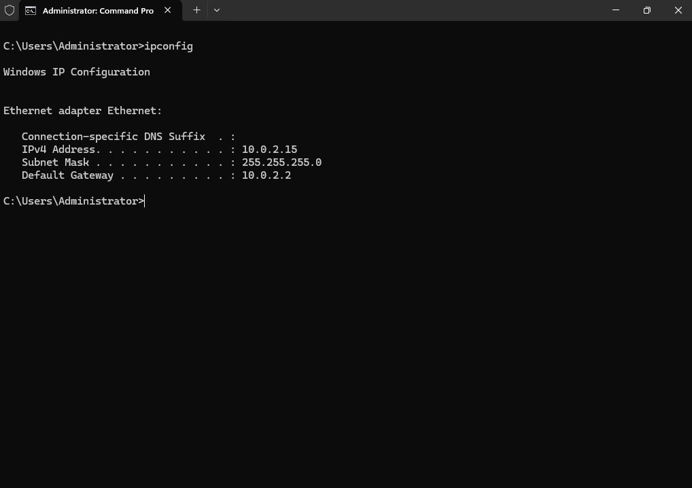
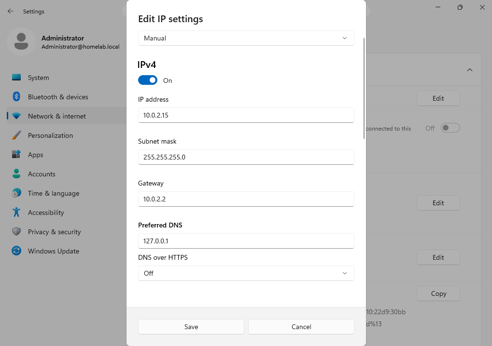
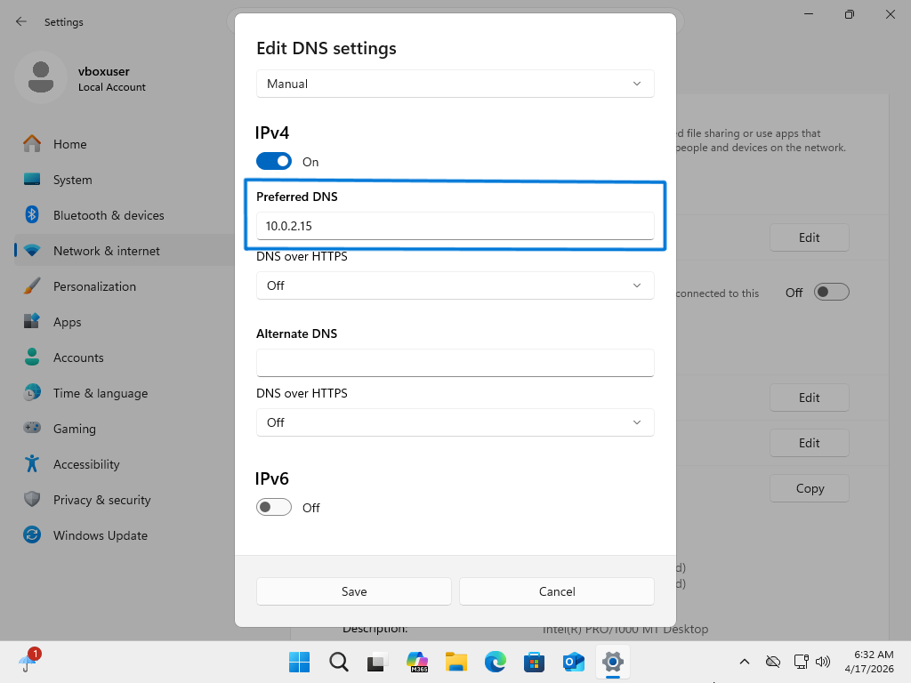
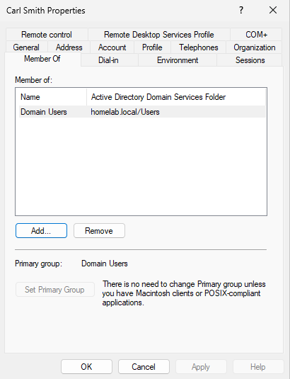
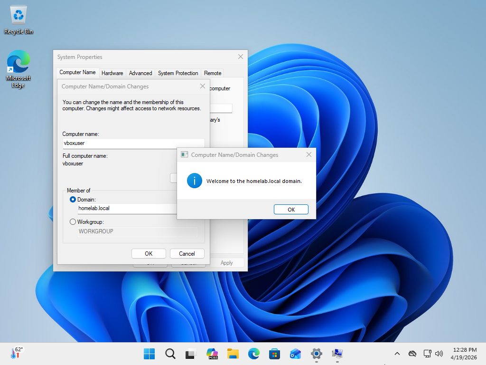

# Active Directory Home Lab (Oracle VirtualBox)

## Overview
Built and configured a virtualized enterprise-style Active Directory environment using Oracle VirtualBox. Deployed a Windows Server 2025 Domain Controller and a Windows 11 client, implemented domain services, and validated authentication through a successful domain join.

---

## Environment / Tech Stack
- Oracle VirtualBox (Virtualization)
- Windows Server 2025 (Domain Controller)
- Windows 11 (Client Machine)
- Active Directory Domain Services (AD DS)
- DNS
- TCP/IP Networking

---

## Lab Architecture
- Deployed two virtual machines:
  - Domain Controller (Windows Server 2025)
  - Client Workstation (Windows 11)
- Configured internal networking for VM-to-VM communication
- Assigned static IP address to Domain Controller
- Configured client machine to use Domain Controller as primary DNS

---

## Server Configuration
- Installed Active Directory Domain Services (AD DS)
- Promoted server to Domain Controller
- Configured domain environment
- Verified hostname and remote management settings
- Installed and validated required server roles and features

---

## Active Directory Management
- Created Organizational Units (OUs) to simulate enterprise structure
- Created multiple domain user accounts
- Created and configured security groups
- Added users to groups to manage access control
- Assigned Domain Admin privileges to designated user accounts

---

## Client Configuration
- Installed and updated Windows 11 client
- Configured network adapter settings
- Verified DNS resolution to Domain Controller
- Ensured connectivity between client and server

---

## Domain Join Process
- Configured client machine DNS to point to Domain Controller
- Used domain credentials created in Active Directory
- Successfully joined Windows 11 machine to the domain
- Verified domain authentication by logging in with domain user
- Confirmed domain connectivity and access permissions

---

## Key Skills Demonstrated
- Active Directory Administration
- User and Group Management
- Domain Controller Deployment
- DNS Configuration
- Network Configuration (TCP/IP)
- Virtualization (Oracle VirtualBox)
- Windows Server Management
- Endpoint Domain Integration

---

## Key Takeaways
- Proper DNS configuration is critical for domain functionality and authentication
- Active Directory structure relies on organized OUs, users, and group-based permissions
- Domain Controllers must be correctly configured before client integration
- Step-by-step validation is essential when deploying enterprise environments

## Screenshots

### 1. Downloading Installation Files

### 2. Creating the Windows Server Virtual Machine

### 3. Creating the Windows 11 Virtual Machine

### 4. Initial Server and Client Setup

### 5. Installing Active Directory Domain Services

### 6. Network Configuration

### 7. Active Directory Organizational Structure

### 8. Creating Domain Users

### 9. Assigning Group Permissions

### 11. Joining the Windows 11 Client to the Domain

### 12. Authentication and Domain Verification

