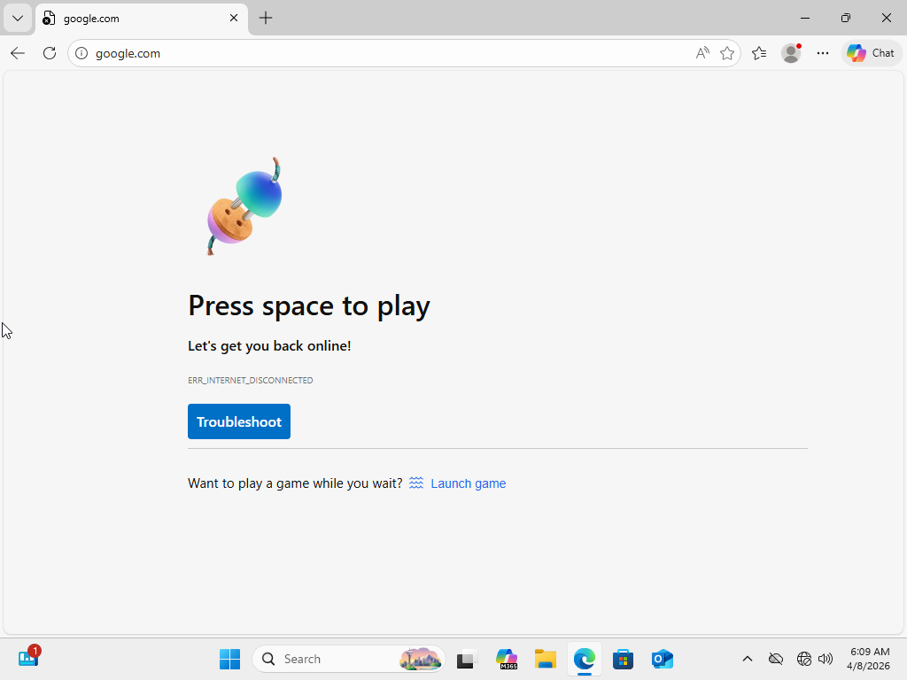
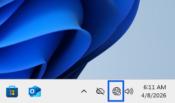
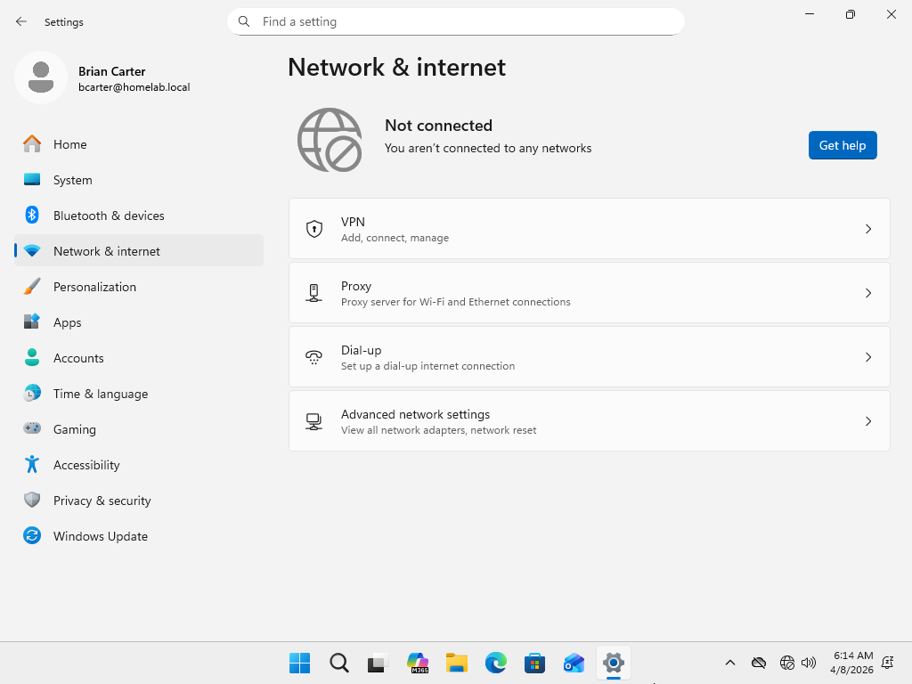
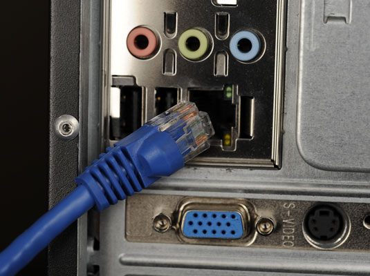
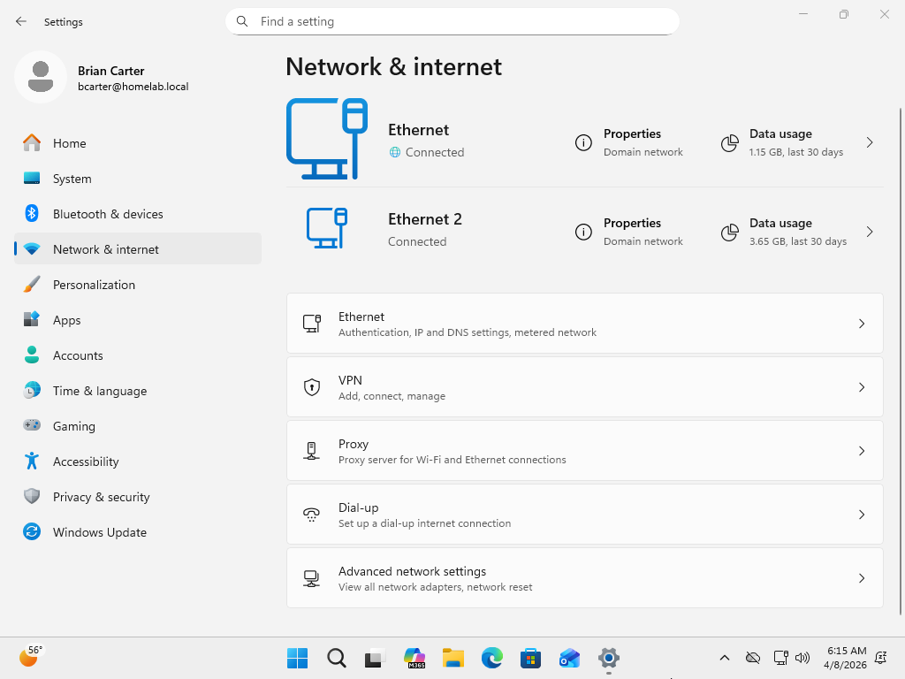
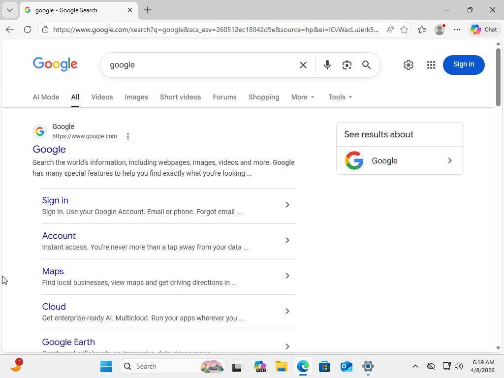

# Cannot Connect to Internet

## Summary
User unable to connect to the internet.

## User
Brian Carter

## Department
Finance

## Issue
User reports system is not connecting to the internet and no websites are loading.

---

## Troubleshooting
- Attempted to access internet via web browser
- Verified pages failed to load
- Checked network status indicator (no connection)
- Observed globe icon in taskbar (no network)
- Confirmed environment uses Ethernet connection
- Inspected physical network connection
- Identified unplugged Ethernet cable

---

## Resolution
- Reconnected Ethernet cable to workstation
- Restored network connectivity
- Verified network status shows active connection
- Tested internet access via web browser
- Confirmed system successfully loads external websites

---

## Screenshots

### 1. Ticket (Spiceworks)

### 2. Reported Issue

### 3. Troubleshooting Steps

### 4. Issue Resolved (Working State)

