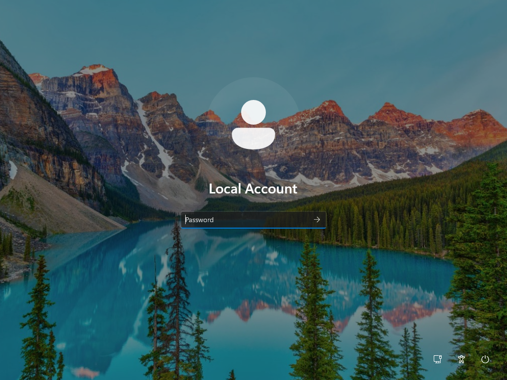

# Login Issue

## Summary
User unable to log in to workstation.

## User
Olivia Martinez

## Department
HR

## Issue
User reports login failure and notices system appears different than usual.

---

## Troubleshooting
- Attempted login using domain credentials
- Observed authentication failure (invalid credentials)
- Identified login screen as local account (not domain)
- Determined system not joined to domain
- Logged in using local administrator account
- Navigated to system settings (About)
- Accessed domain join configuration
- Initiated domain join process
- Authenticated using domain administrator credentials
- Restarted system to apply changes

---

## Resolution
- Rejoined workstation to domain
- Restored domain authentication functionality
- Verified domain login screen appears on startup
- Confirmed user successfully logs in with domain credentials

---

## Screenshots

### 1. Ticket (Spiceworks)

### 2. Reported Issue

### 3. Troubleshooting Steps

### 4. Issue Resolved (Working State)

