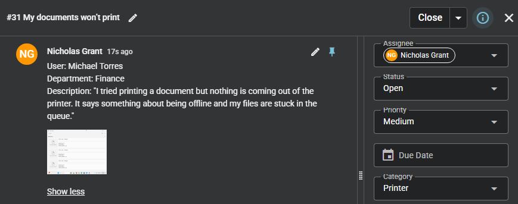
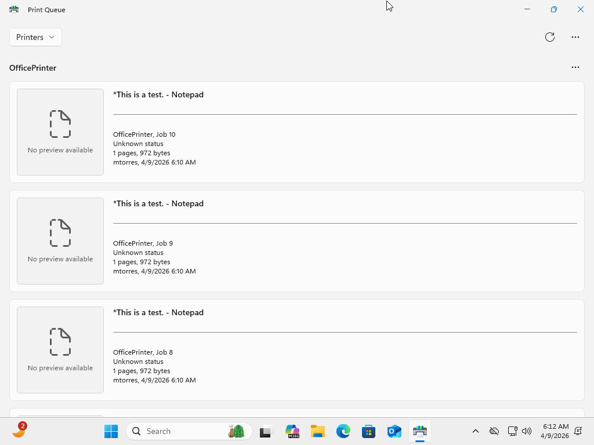
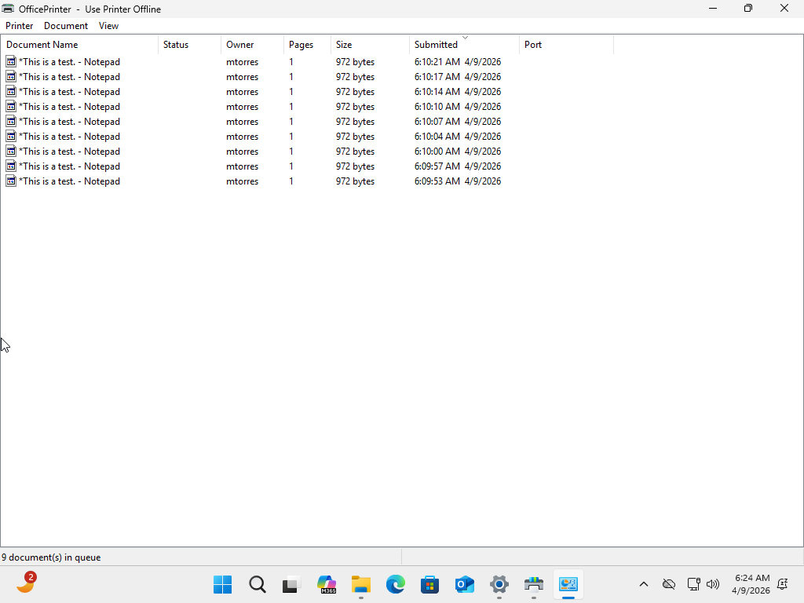
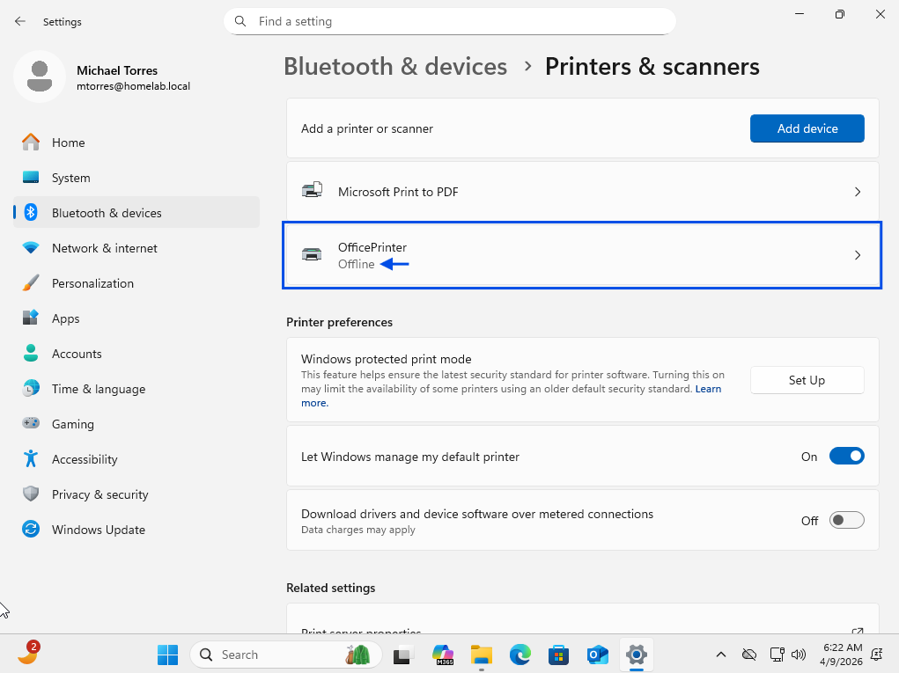
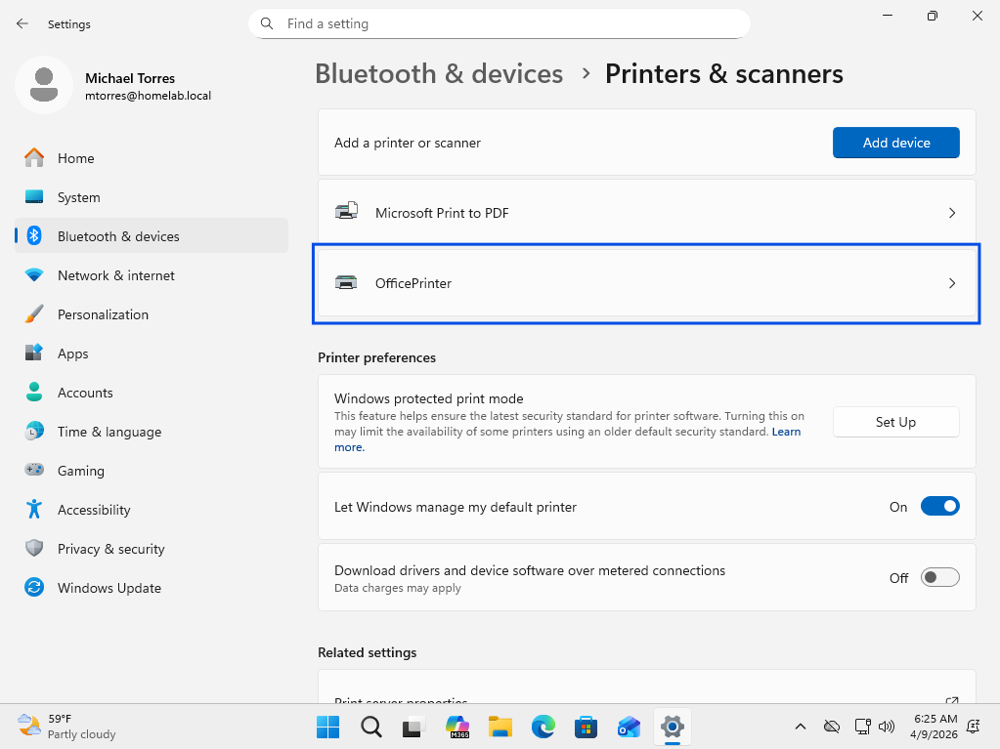
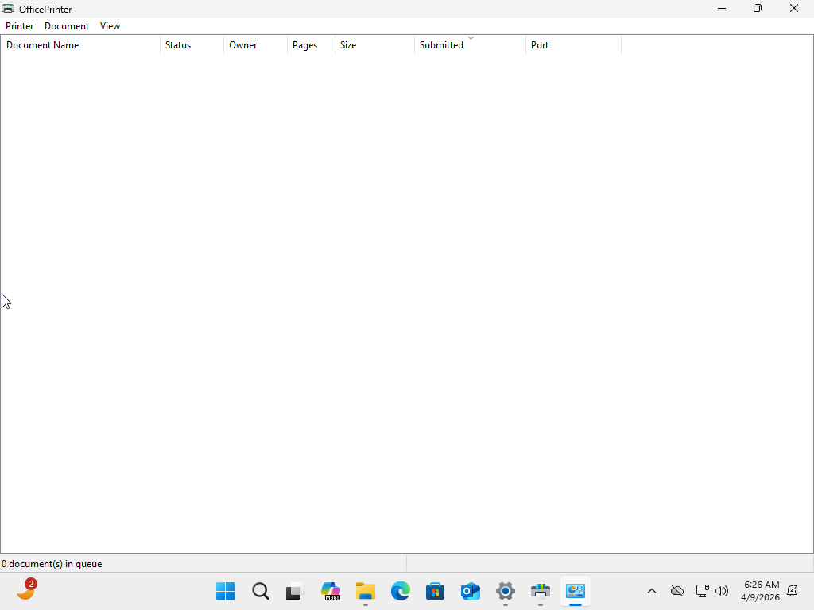
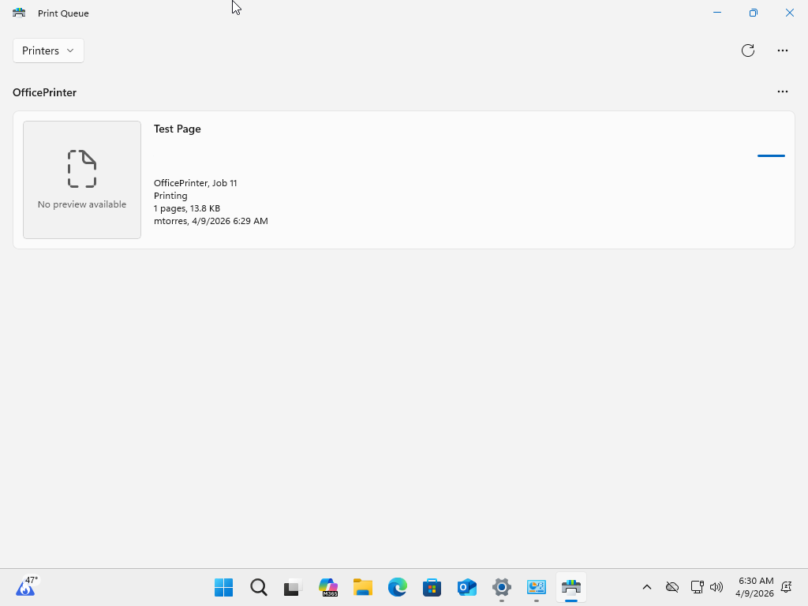
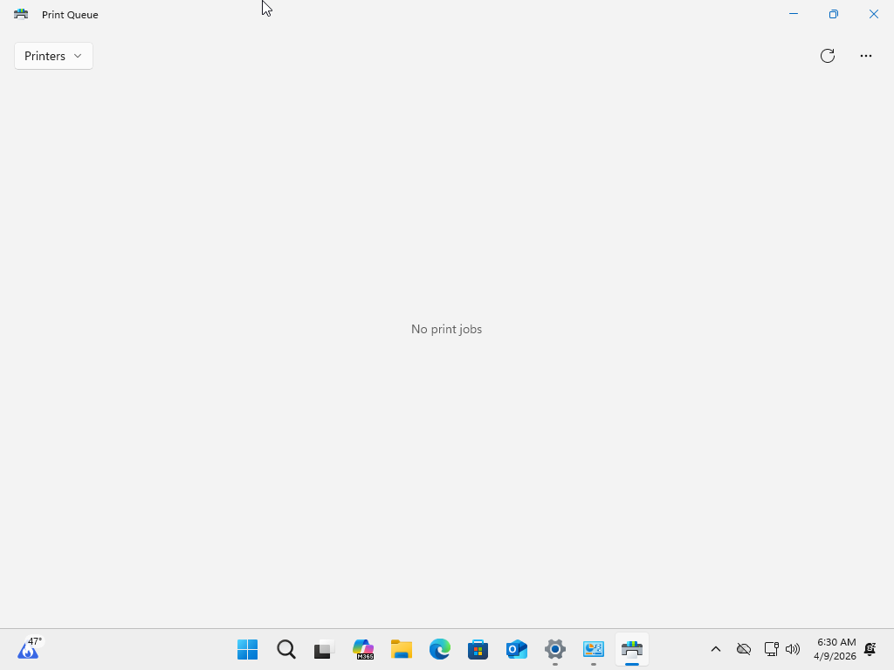

# Printer Not Working

## Summary
User unable to print documents.

## User
Michael Torres

## Department
Finance

## Issue
User reports documents are not printing and print jobs are stuck in the queue. Printer appears offline.

---

## Troubleshooting
- Checked printer queue for pending jobs
- Identified multiple print jobs stuck in queue
- Reviewed printer status in settings
- Detected printer set to offline
- Verified print job status (no progress)
- Accessed printer management settings

---

## Resolution
- Set printer status to online
- Cleared print queue
- Initiated test print
- Confirmed print job processed successfully
- Verified printer functionality restored

---

## Screenshots

### 1. Ticket (Spiceworks)

### 2. Reported Issue

### 3. Troubleshooting Steps

### 4. Issue Resolved (Working State)

