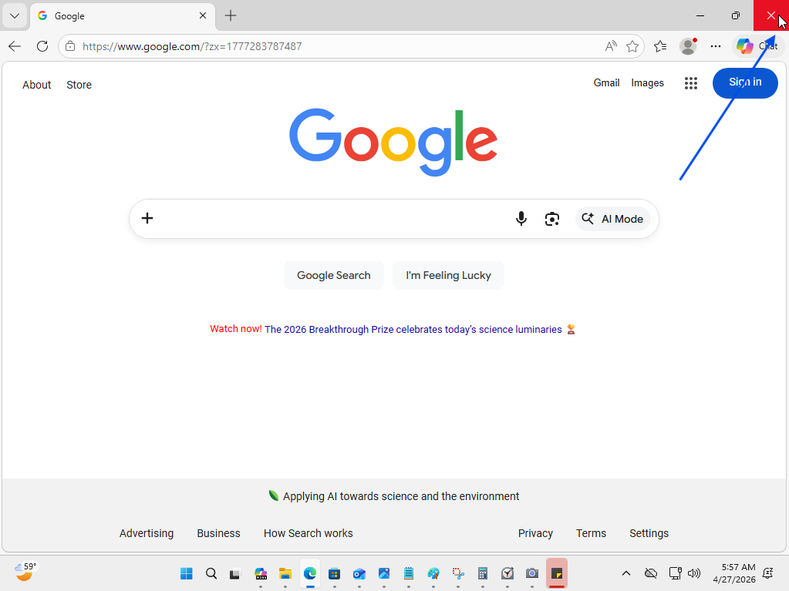
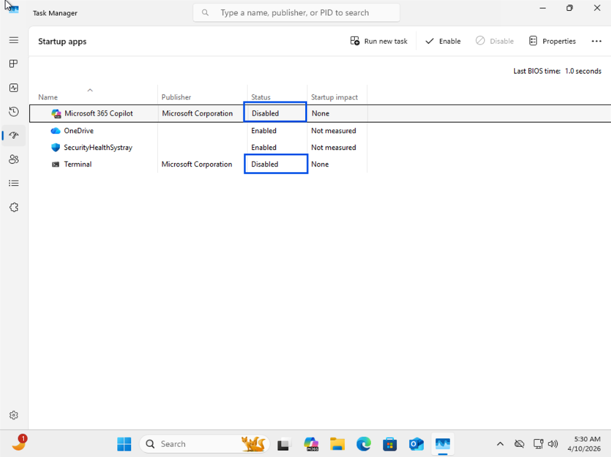

# Slow Computer Performance

## Summary
User experiencing slow system performance.

## User
David Lee

## Department
Operations

## Issue
User reports slow startup and poor performance when opening applications.

---

## Troubleshooting
- Reproduced issue by launching web browser
- Observed slow application response
- Reviewed system performance in Task Manager
- Identified high CPU, memory, and disk utilization
- Analyzed running processes
- Detected multiple instances of same application
- Reviewed startup applications
- Identified excessive startup programs enabled
- Inspected file system for storage usage
- Detected numerous duplicate files
- Reviewed performance settings
- Identified all visual effects enabled

---

## Resolution
- Closed duplicate running applications
- Disabled unnecessary startup programs
- Restarted system
- Removed duplicate files
- Executed Disk Cleanup (cleanmgr.exe)
- Adjusted performance settings to prioritize performance
- Verified reduced CPU, memory, and disk usage
- Confirmed improved application load times

---

## Screenshots

### 1. Ticket (Spiceworks)

### 2. Reported Issue (User Perspective)

### 3. Initial System Assessment (Technician View)

### 4. Troubleshooting Actions (System Optimization)

### 5. Issue Resolved (Optimized System)

