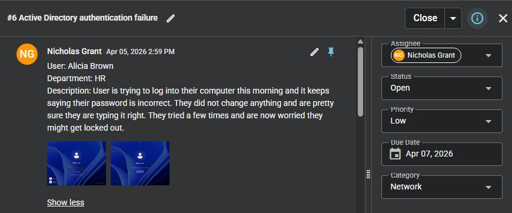
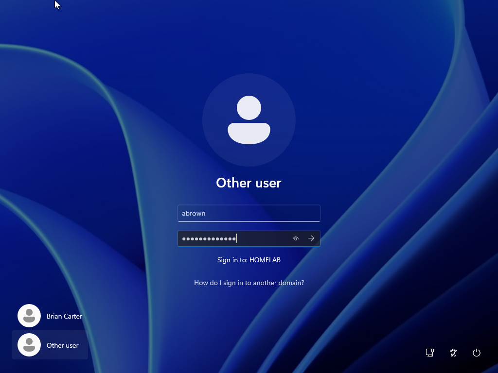
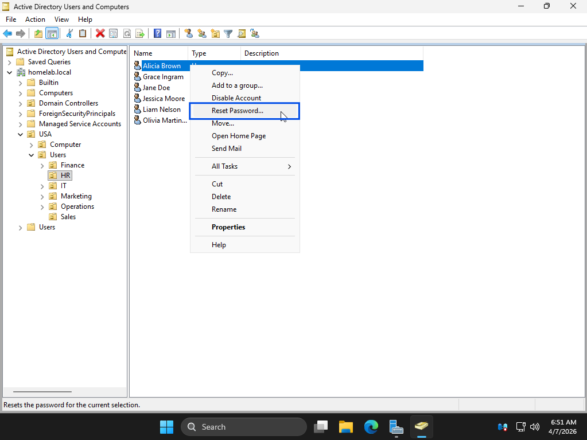
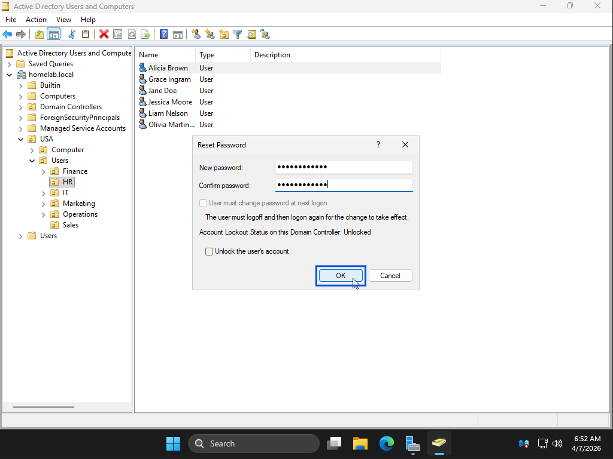
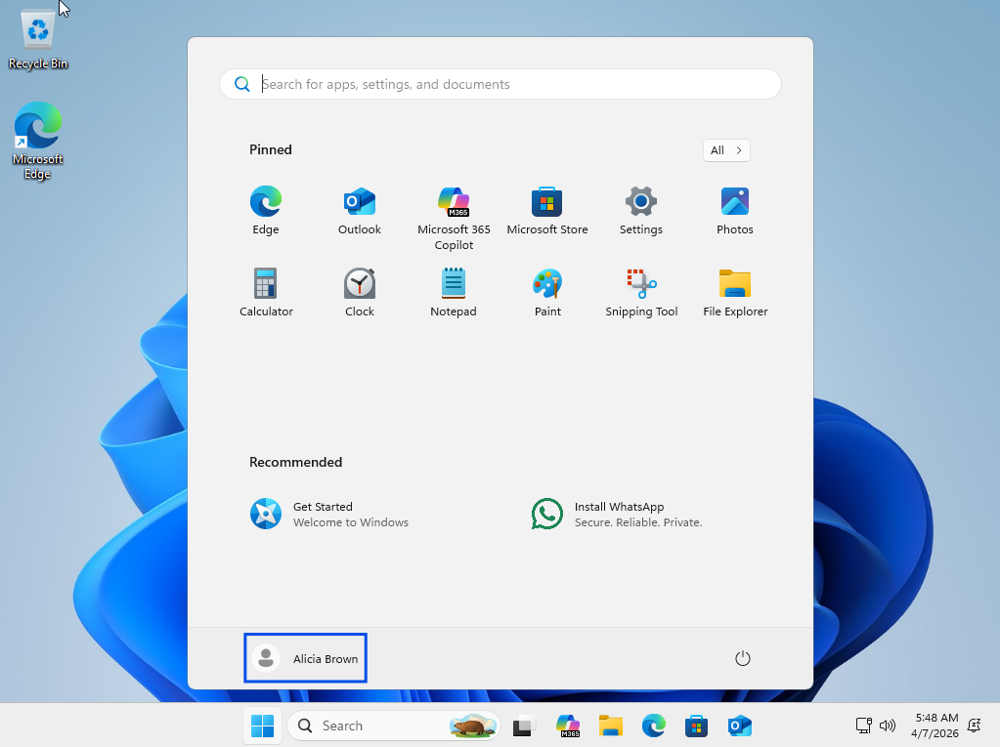

# Active Directory Authentication Failure

## Summary
User unable to authenticate due to incorrect credentials.

## User
Alicia Brown

## Department
HR

## Issue
User reports receiving error: "The user name or password is incorrect. Try again."  
User confirms credentials have not been changed and believes they are entering them correctly.

---

## Troubleshooting
- Reviewed user-reported authentication error
- Identified issue consistent with incorrect credentials
- Opened Active Directory Users and Computers
- Located user account
- Reviewed account options and status
- Verified no account restrictions or lockout conditions
- Determined password reset required

---

## Resolution
- Reset user password in Active Directory
- Applied changes to account
- Provided updated credentials to user
- Confirmed successful authentication on client machine

---

## Screenshots

### 1. Ticket (Spiceworks)

### 2. Reported Issue

### 3. Troubleshooting Steps

### 4. Issue Resolved (Working State)

