# Cannot Access Shared Drive

## Summary
User unable to access shared network drive due to permission issue.

## User
Emily Rodriguez

## Department
Marketing

## Issue
User reports inability to access shared drive (Z:).  
Error displayed: "You do not have permission to access \\FILESERVER01\Marketing\."

---

## Troubleshooting
- Reviewed user-reported permission error
- Identified access denied message on shared drive
- Accessed file server hosting shared directory
- Opened folder properties
- Navigated to Sharing tab and Advanced Sharing settings
- Reviewed share permissions
- Identified missing "Domain Users" group in share permissions
- Added "Domain Users" with read access
- Navigated to Security tab
- Reviewed NTFS permissions
- Identified missing "Domain Users" group
- Added "Domain Users" with read and execute permissions
- Applied all permission changes

---

## Resolution
- Added "Domain Users" to share permissions
- Added "Domain Users" to NTFS security permissions
- Applied correct access levels (Read, List Folder Contents, Read & Execute)
- Confirmed user can access shared drive
- Verified folder contents visible on client machine

---

## Screenshots

### 1. Ticket (Spiceworks)
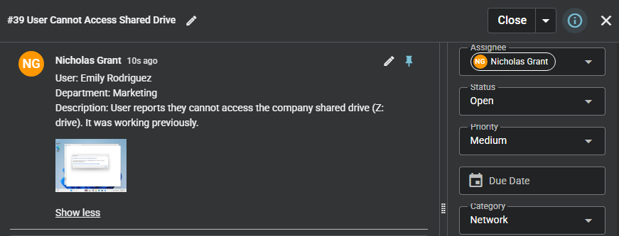

### 2. Reported Issue
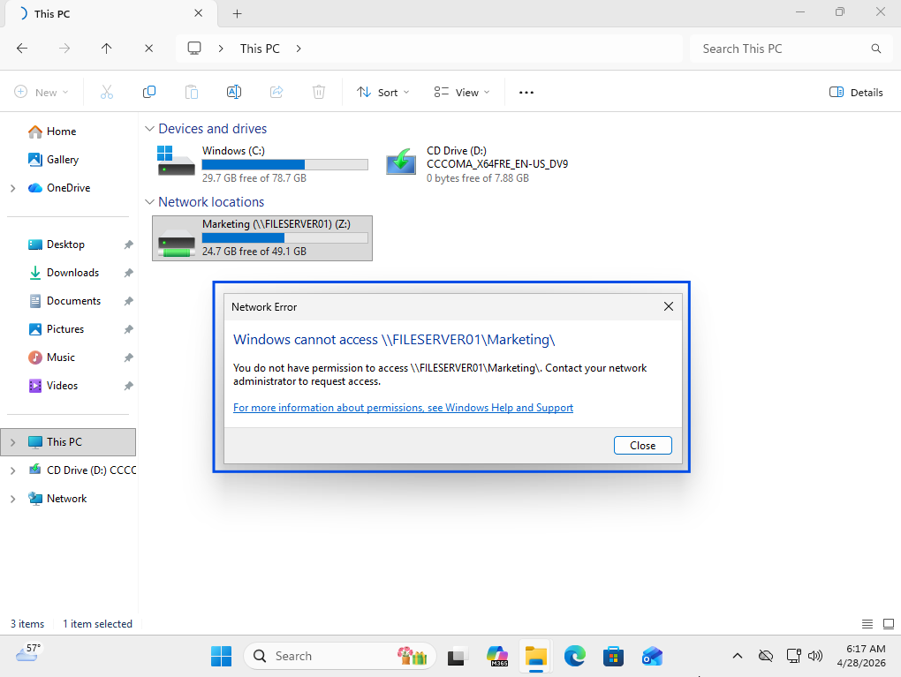

### 3. Troubleshooting Steps
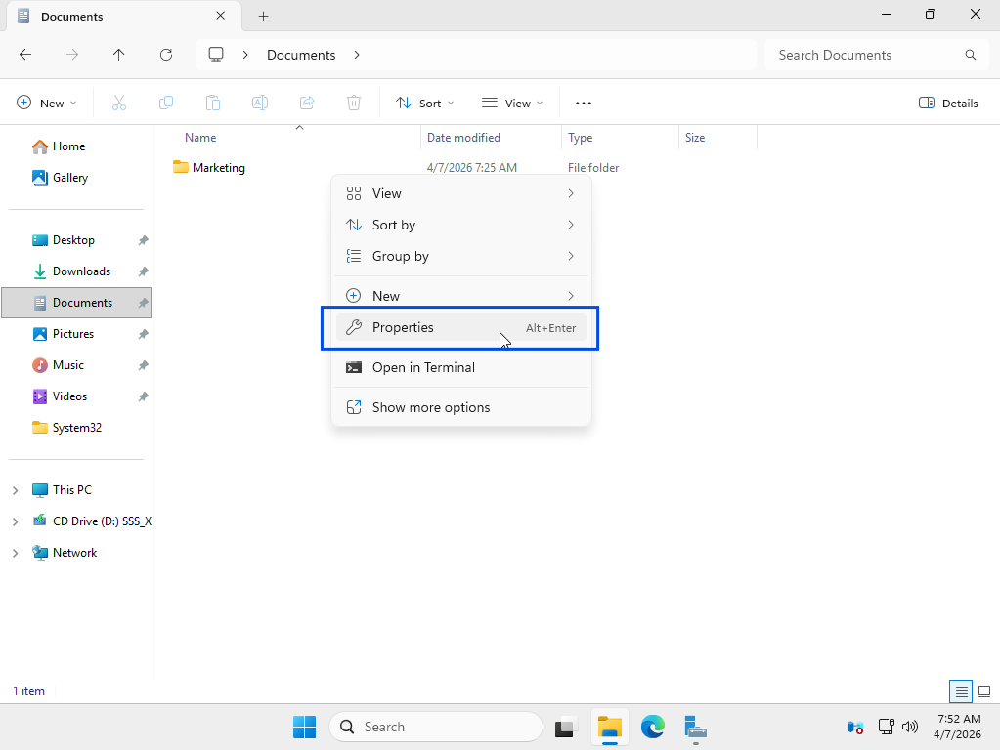
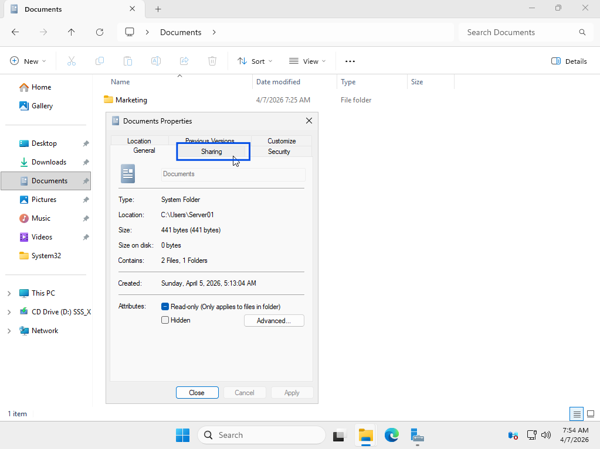
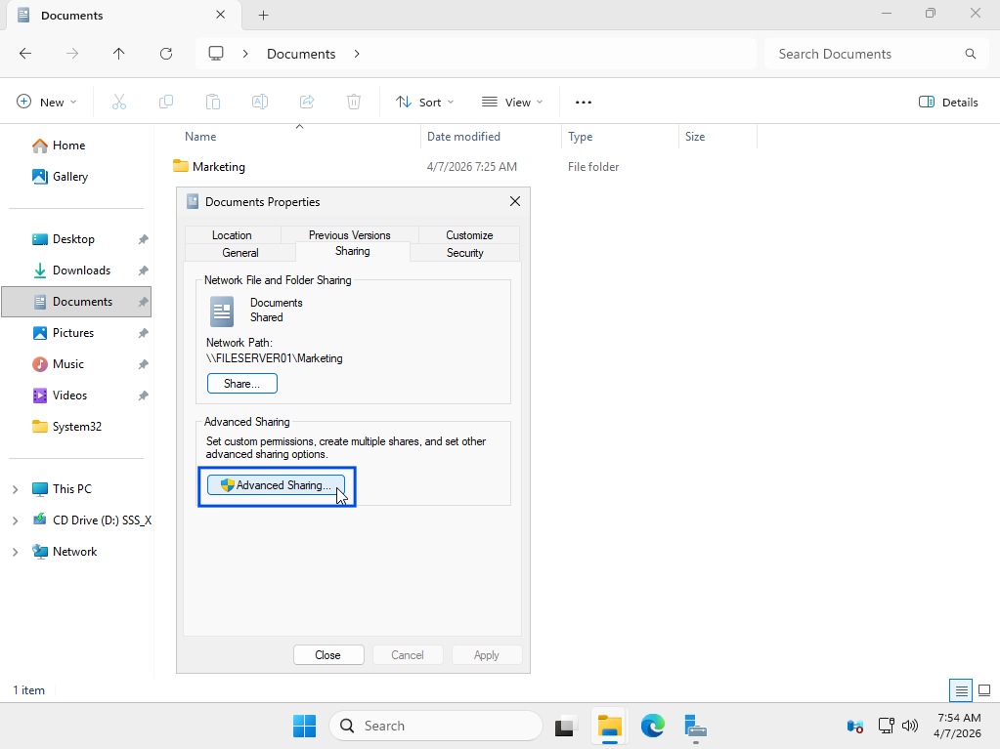

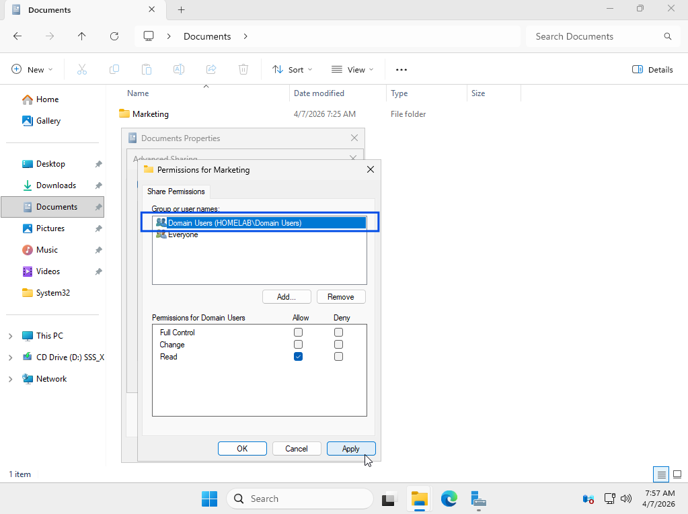
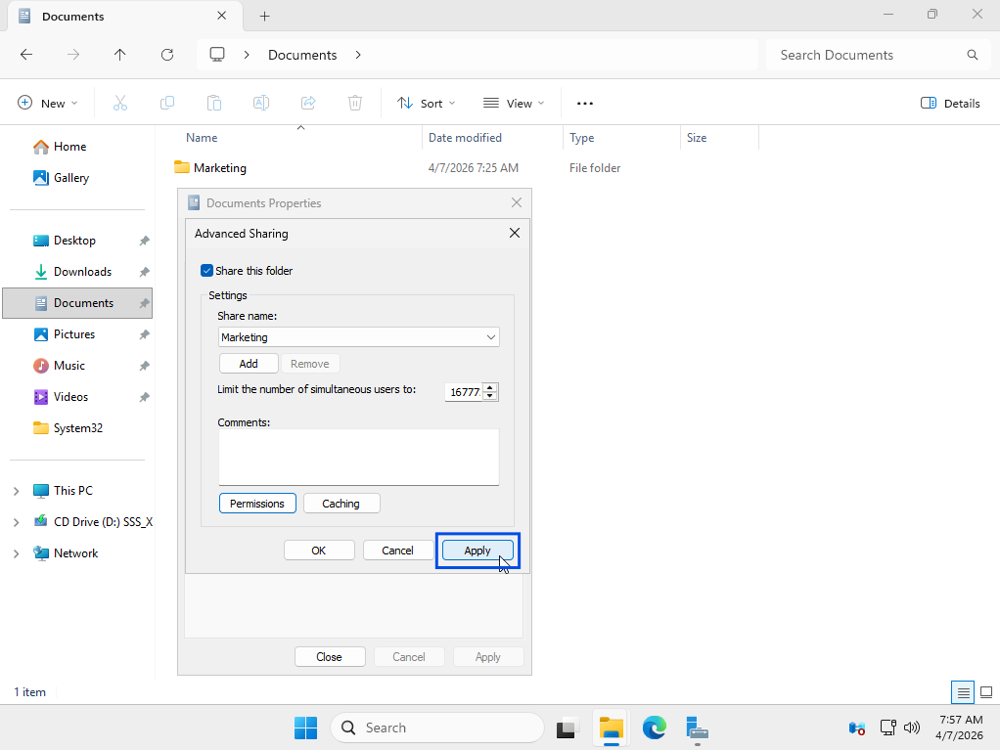

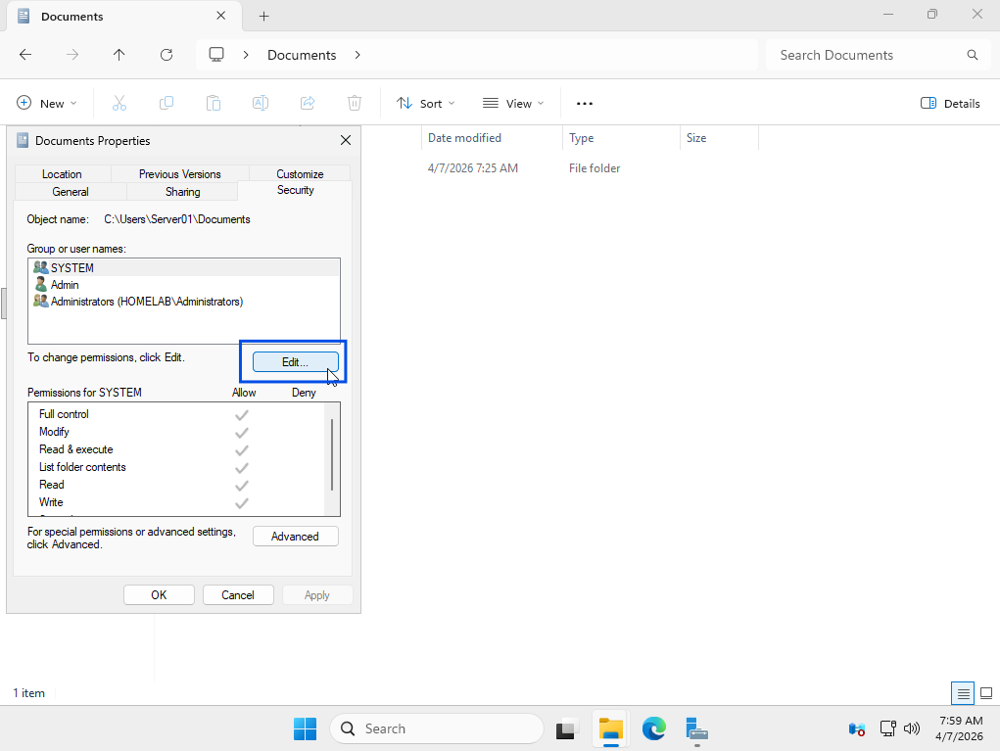
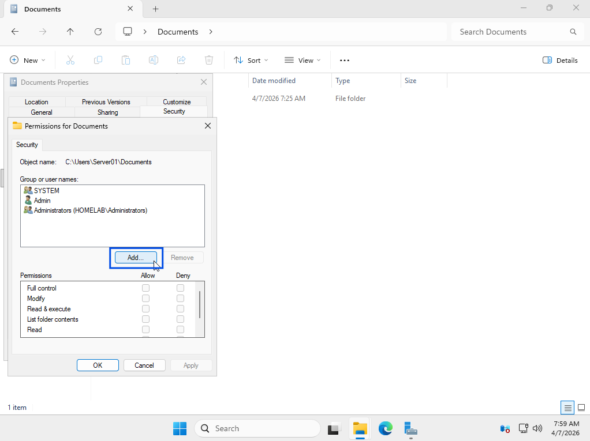

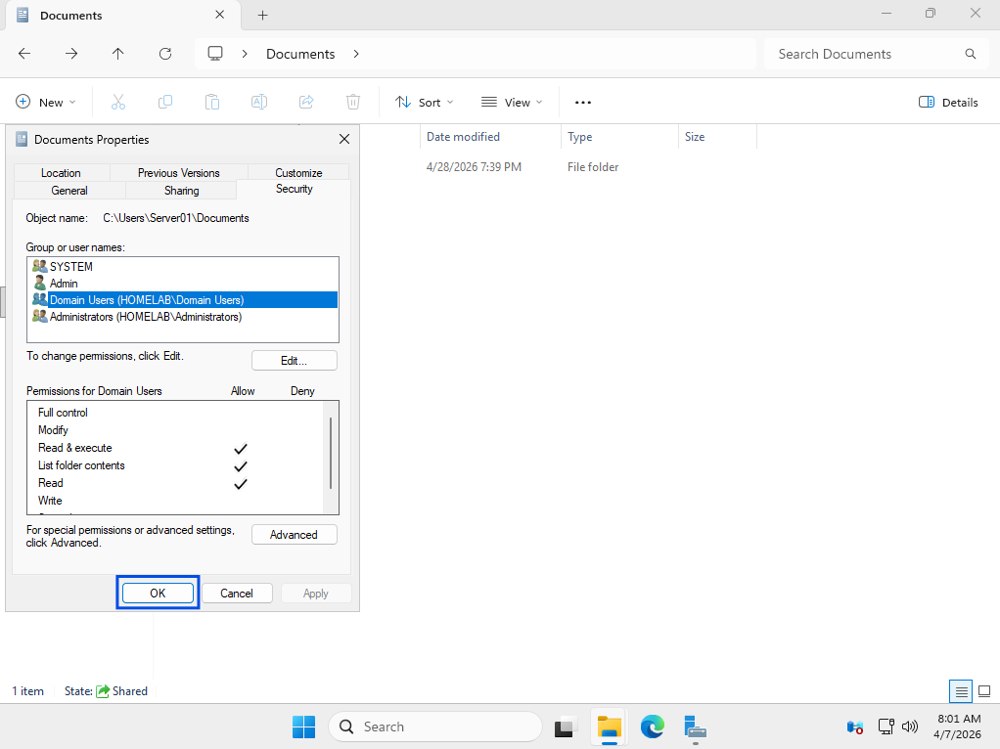

### 4. Issue Resolved (Working State)
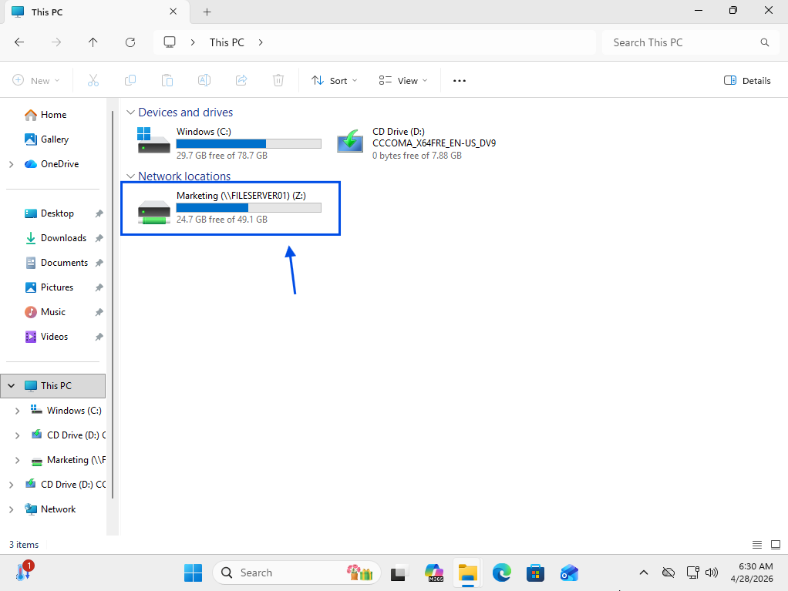
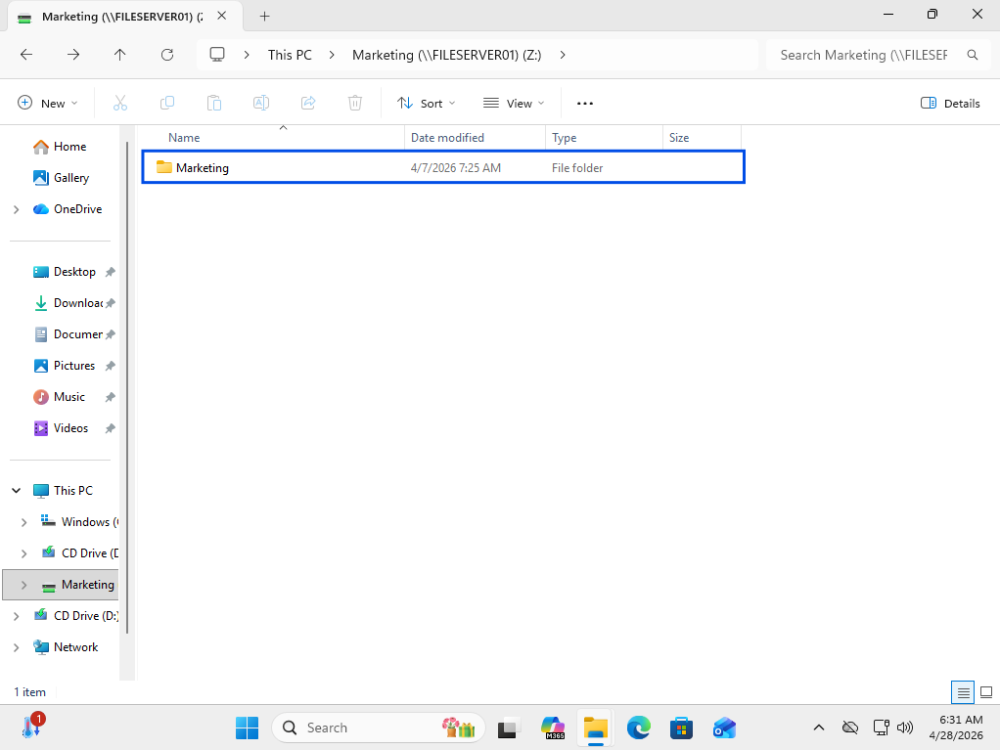
