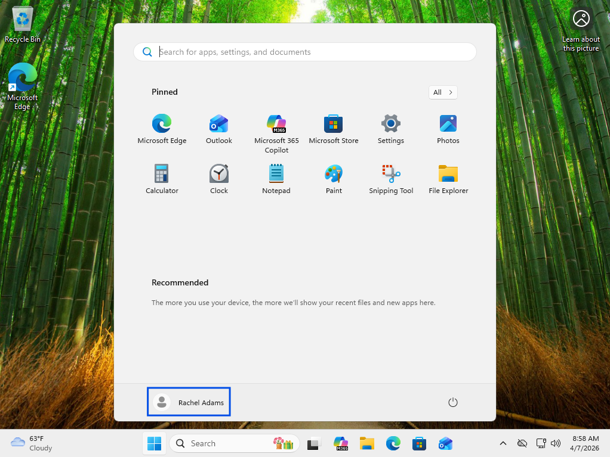

# Disabled User Account

## Summary
User unable to log in due to disabled account.

## User
Rachel Adams

## Department
Finance

## Issue
User reports login failure despite correct credentials.  
Error displayed: "Your account has been disabled. Please see your system administrator."

---

## Troubleshooting
- Reviewed user-reported login error
- Identified account disabled message
- Accessed Active Directory Users and Computers
- Located user account
- Opened account properties
- Navigated to account settings
- Verified "Account is disabled" option enabled
- Identified root cause as disabled account status

---

## Resolution
- Re-enabled user account in Active Directory
- Applied changes to account settings
- Confirmed account status updated
- User successfully authenticated on client machine

---

## Screenshots

### 1. Ticket (Spiceworks)

### 2. Reported Issue

### 3. Troubleshooting Steps

### 4. Issue Resolved (Working State)

