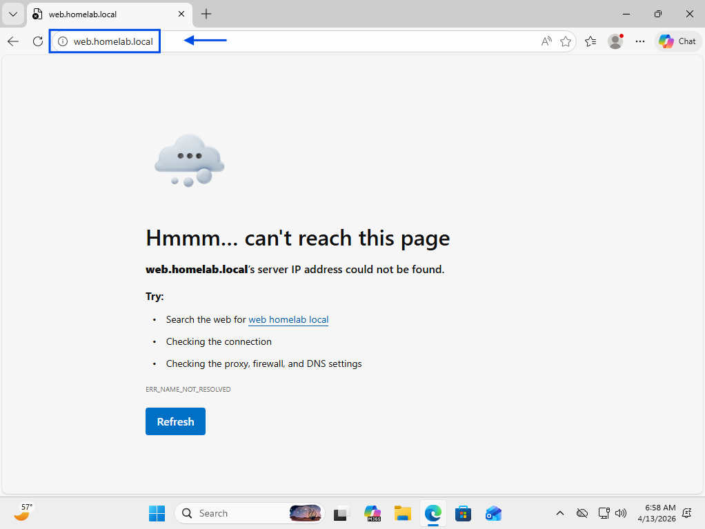

# DNS Resolution Failure

## Summary
User unable to access internal website via hostname due to DNS resolution issue.

## User
Michael Thompson

## Department
Operations

## Issue
User reports inability to access internal site using hostname.  
User confirms site is accessible when using IP address.

---

## Troubleshooting
- Reviewed user-reported access behavior
- Identified hostname resolution failure with IP access working
- Determined issue related to DNS resolution
- Opened Command Prompt on client machine
- Tested connectivity using hostname (ping failed)
- Tested connectivity using IP address (ping successful)
- Accessed Domain Controller
- Opened DNS Manager
- Navigated to Forward Lookup Zones
- Reviewed existing DNS records
- Identified missing A record for web server
- Created new A record for "web" (web.homelab.local)
- Verified DNS record creation

---

## Resolution
- Created missing A record in DNS Manager
- Mapped hostname to correct IP address
- Verified hostname resolution using Command Prompt
- Confirmed internal website accessible via hostname
- User access restored

---

## Screenshots

### 1. Ticket (Spiceworks)

### 2. Reported Issue

### 3. Troubleshooting Steps

### 4. Issue Resolved (Working State)

