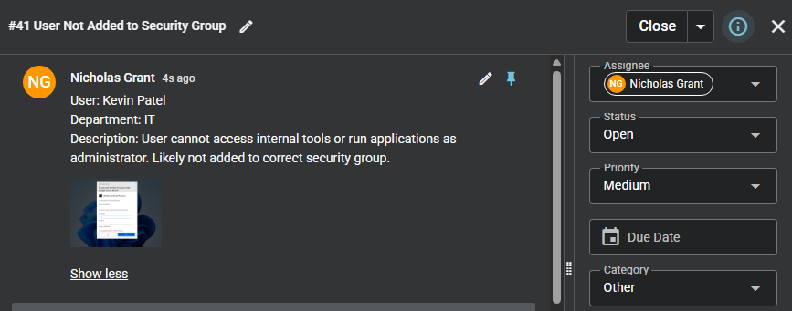
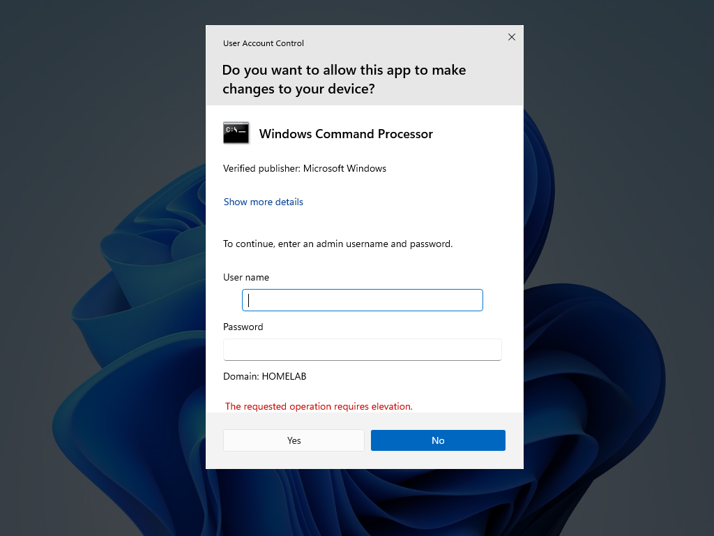
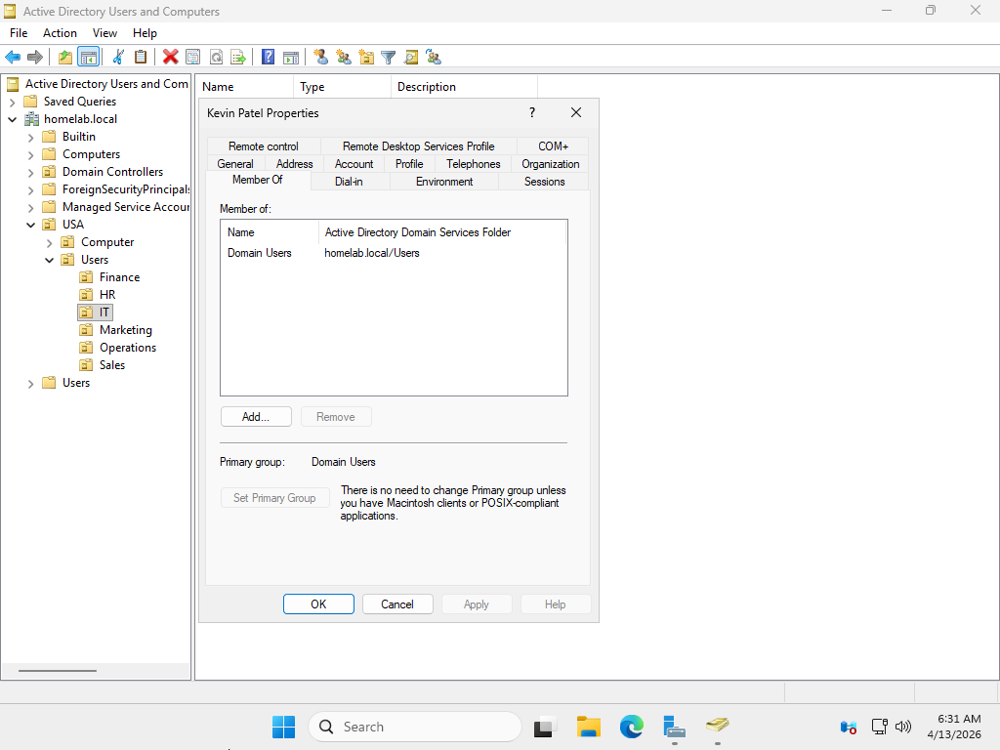
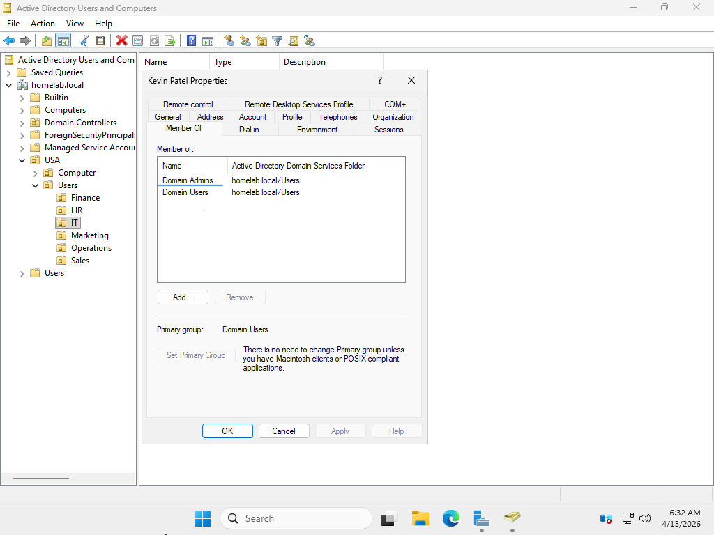
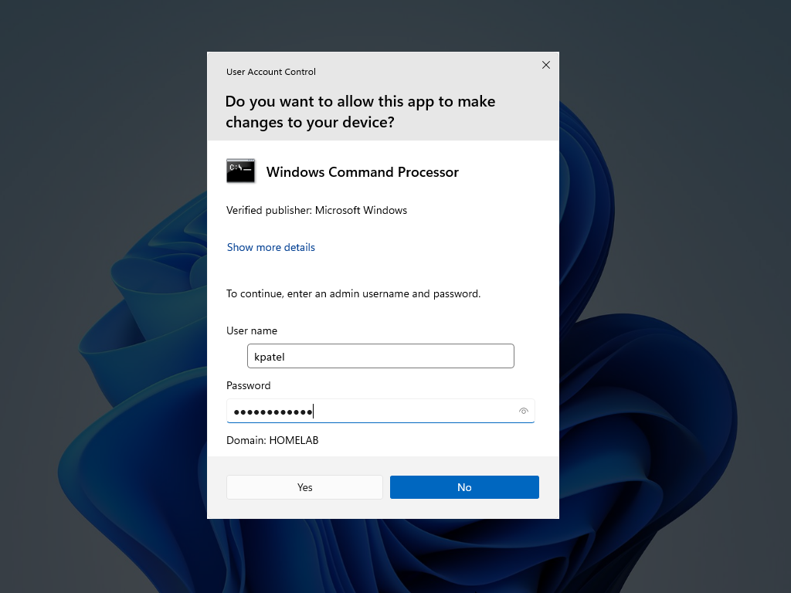
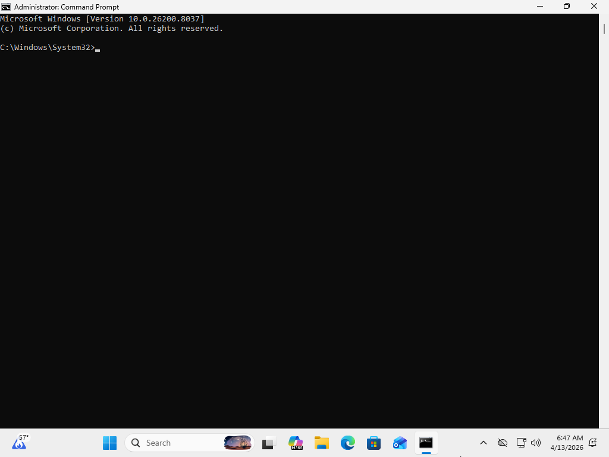
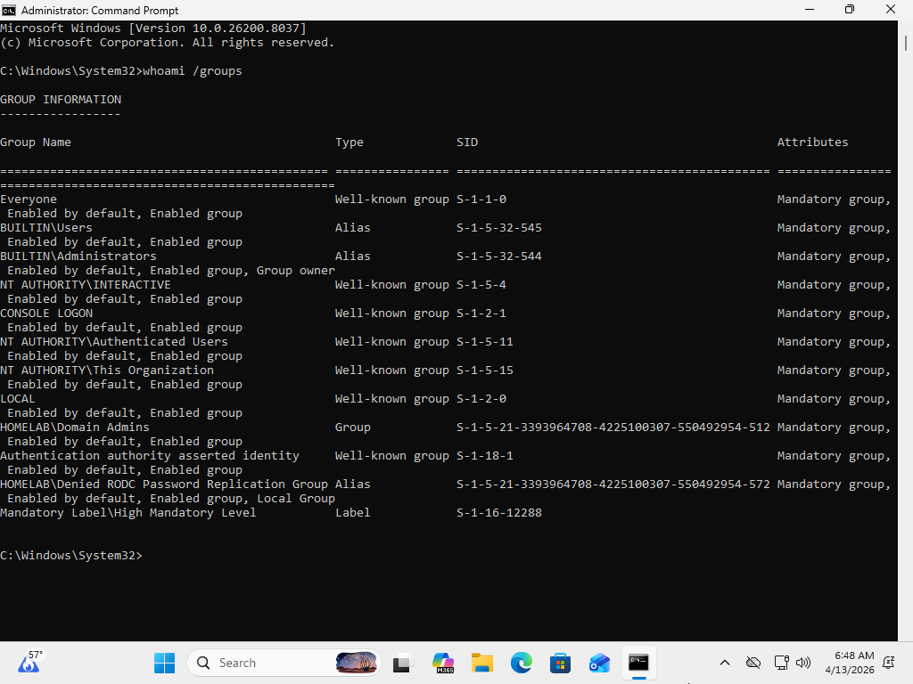

# User Not Added to Security Group

## Summary
User unable to perform administrative actions due to missing group membership.

## User
Kevin Patel

## Department
IT

## Issue
User reports inability to run applications with administrative privileges.  
User expected to have elevated access based on role.

---

## Troubleshooting
- Reviewed user-reported privilege issue
- Identified failure when attempting to run application as administrator
- Determined issue related to insufficient permissions
- Accessed Active Directory Users and Computers
- Navigated to IT Organizational Unit (OU)
- Located user account
- Opened account properties
- Navigated to "Member Of" tab
- Reviewed group memberships
- Identified user only part of "Domain Users" group
- Determined missing "Domain Admins" group membership
- Added user to "Domain Admins" security group
- Applied updated group membership

---

## Resolution
- Added user to "Domain Admins" security group
- Applied group membership changes
- Verified elevated privileges assigned
- Confirmed user can run applications as administrator
- Validated successful execution using admin credentials

---

## Screenshots

### 1. Ticket (Spiceworks)

### 2. Reported Issue

### 3. Troubleshooting Steps

### 4. Issue Resolved (Working State)

