# Microsoft 365 User License Assignment Administration

## Overview
Demonstrated hands-on experience assigning a **Microsoft 365 Business Standard** license to an active user account through the Microsoft 365 Admin Center. This process involved accessing user account licensing settings, applying an enterprise subscription license, and saving administrative changes to provision organizational access.

This project demonstrates practical experience with Microsoft 365 user administration, license management, and identity-based access provisioning in an enterprise cloud environment.

---

## Environment / Tech Stack
- Microsoft 365 Admin Center
- Microsoft Entra ID
- Microsoft 365 Business Standard
- User Account Administration
- License Management

---

## License Administration
- Accessed **Active Users** within Microsoft 365 Admin Center
- Selected an existing user account
- Opened **Licenses and Apps**
- Assigned a **Microsoft 365 Business Standard** license
- Saved administrative changes

---

## Key Skills Demonstrated
- Microsoft 365 Administration
- User License Assignment
- Identity and Access Management (IAM)
- Cloud User Administration
- Subscription Management
- Enterprise Access Provisioning
- Administrative Account Management

---

## Enterprise Relevance / Key Takeaways
License assignment is a fundamental part of enterprise user provisioning and access management. Proper license administration ensures users receive the required subscriptions based on organizational needs while supporting operational consistency and access governance.

---

## Screenshots

### User License Assignment Administration Process

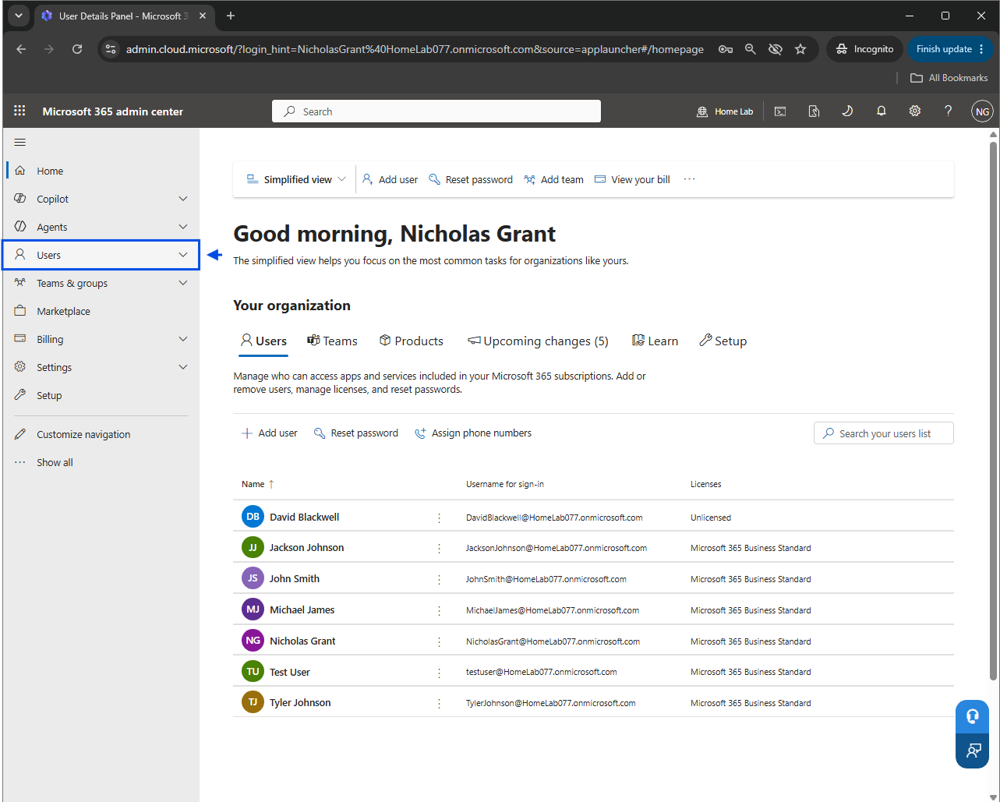
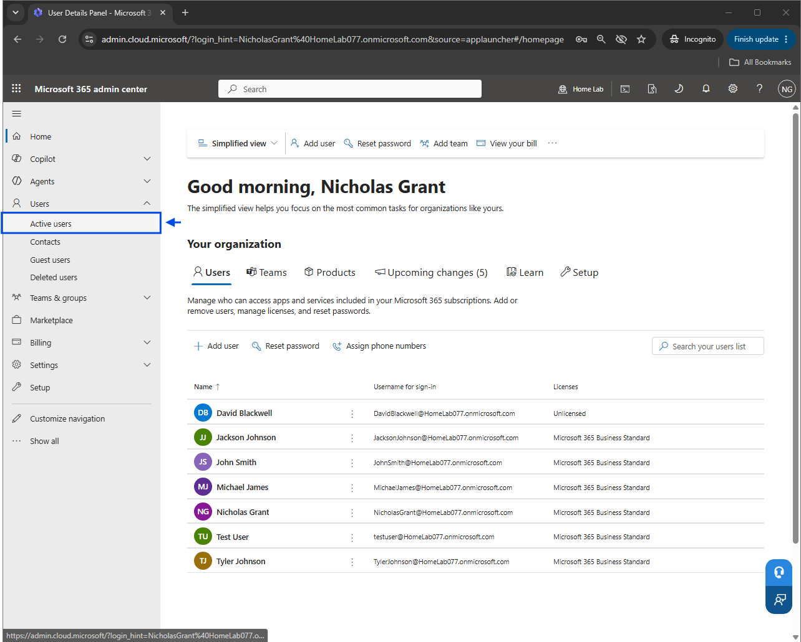
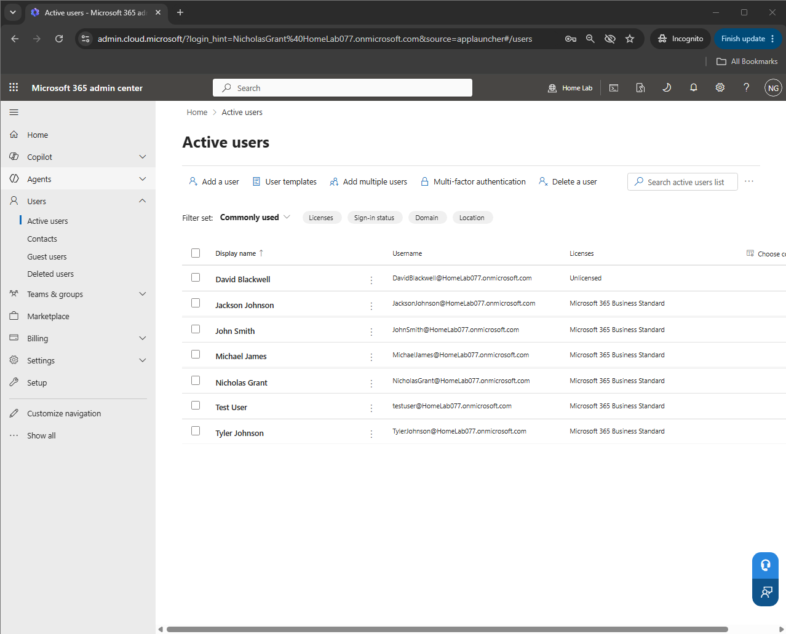
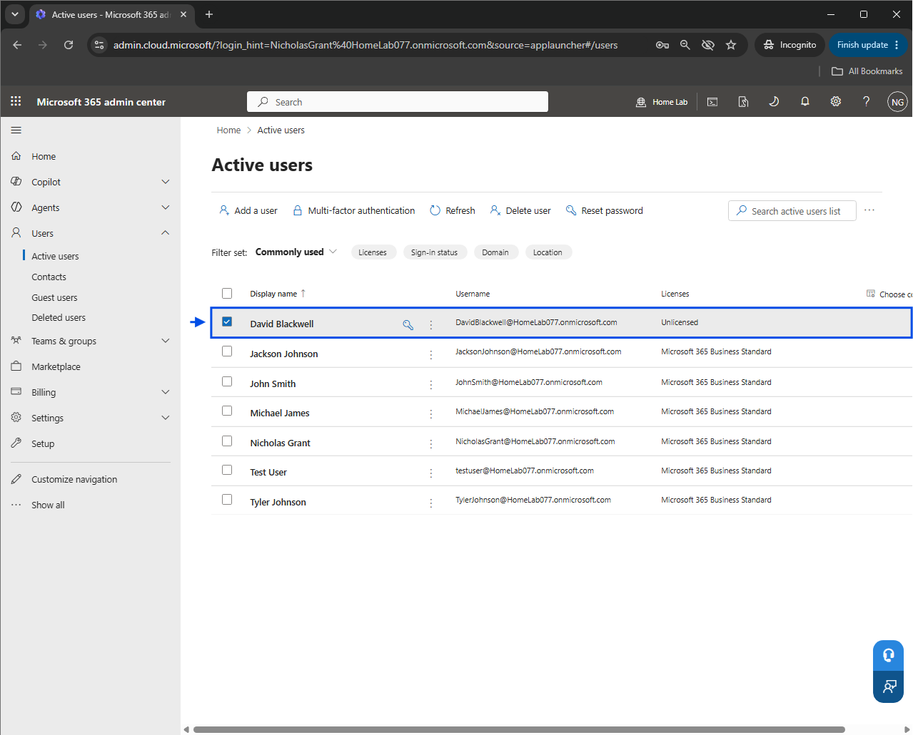
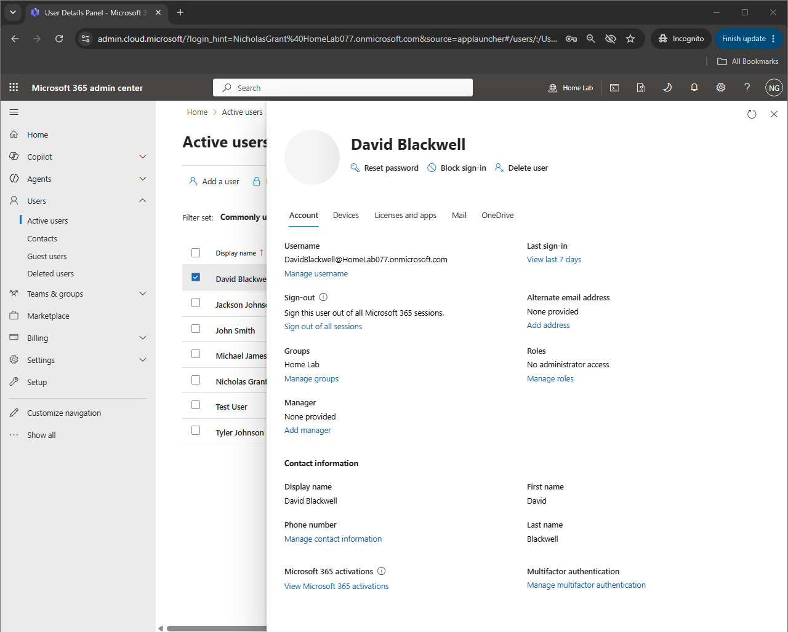
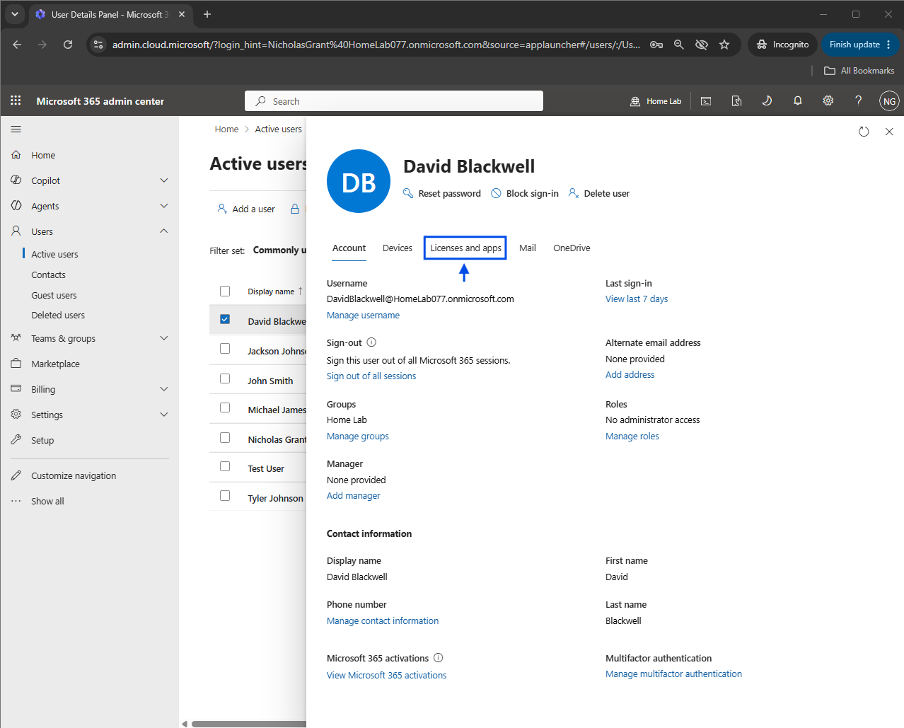
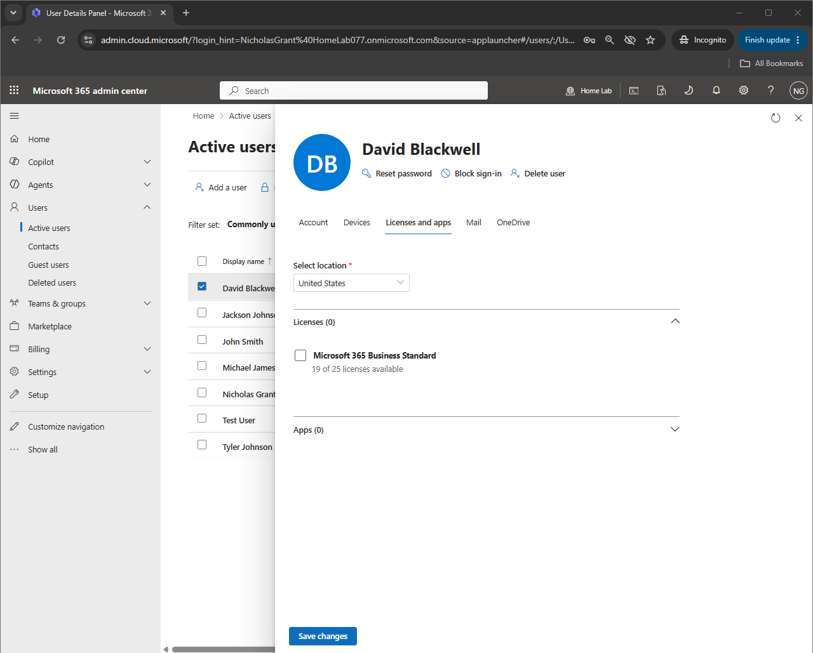
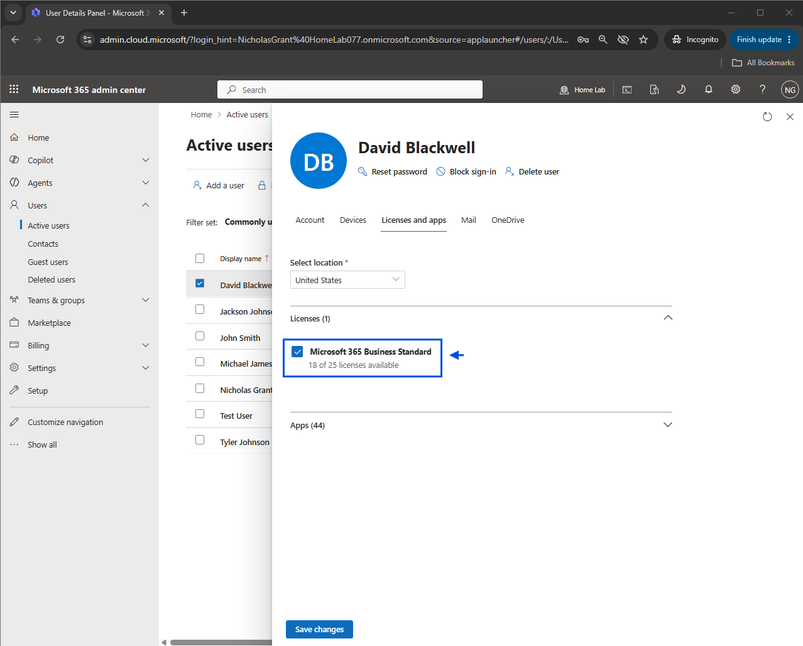
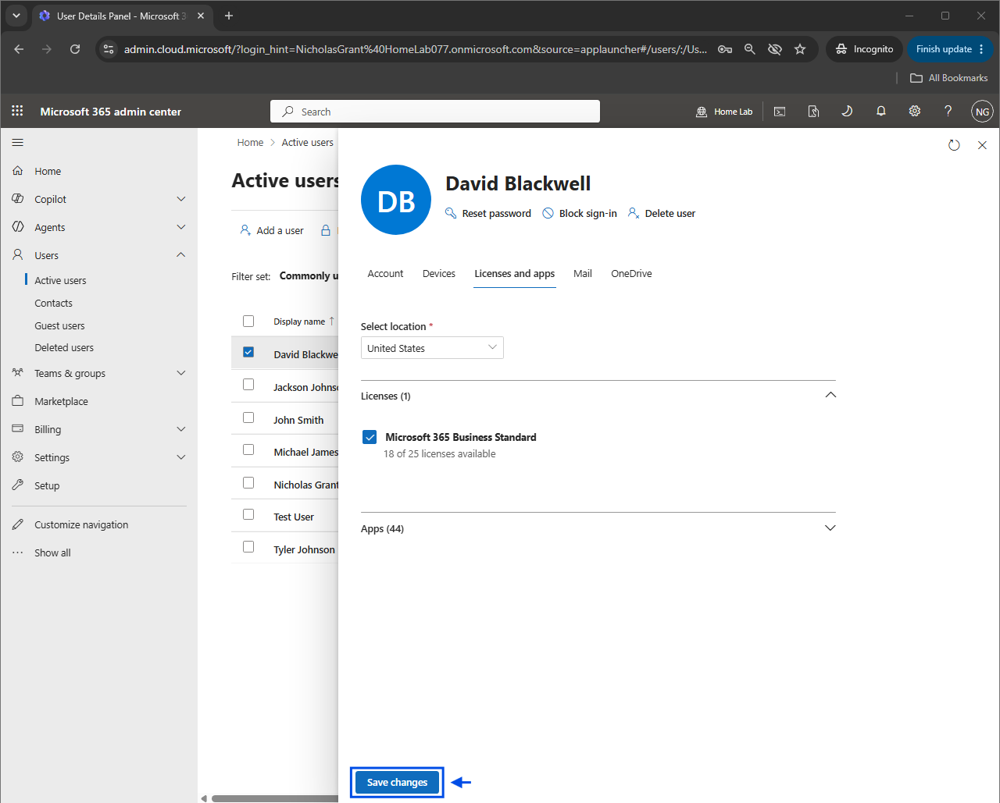
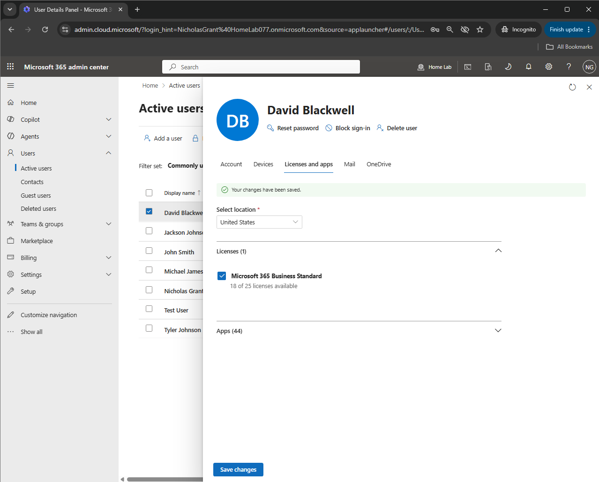
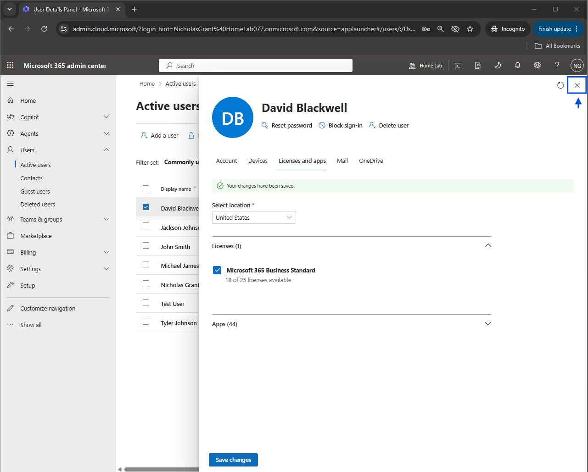
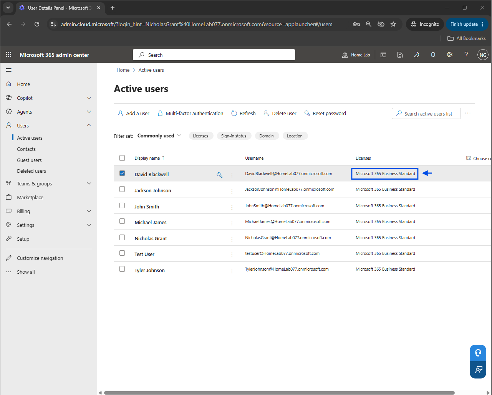
