# User Credential Reset

## Overview
Demonstrated hands-on experience performing an administrative password reset for a user account through the Microsoft 365 Admin Center. This process involved identifying a user unable to access their account, resetting the account credentials, assigning a new password, and validating successful account access with the updated credentials.

This project demonstrates practical experience with Microsoft 365 user credential management, account recovery, authentication troubleshooting, and administrative validation in a cloud-based identity management environment.

---

## Environment / Tech Stack
- Microsoft 365 Admin Center
- Microsoft Entra ID
- User Account Administration
- Identity and Access Management (IAM)
- Credential Recovery Management

---

## User Credential Reset Administration
- Accessed **Active Users** within Microsoft 365 Admin Center
- Selected an existing user account
- Initiated the **Reset Password** workflow
- Created a new password for the user account
- Applied the password reset configuration
- Validated successful user authentication using updated credentials

---

## Key Skills Demonstrated
- Microsoft 365 Administration
- User Password Reset Administration
- Credential Recovery Management
- Identity and Access Management (IAM)
- User Authentication Troubleshooting
- Administrative Account Recovery
- Security Validation

---

## Key Takeaways
Password resets are a core administrative function in identity management and user support. Effective credential recovery ensures users regain secure access to organizational resources while maintaining account security and reducing operational downtime.

---

## Screenshots

### User Authentication Issue Reported

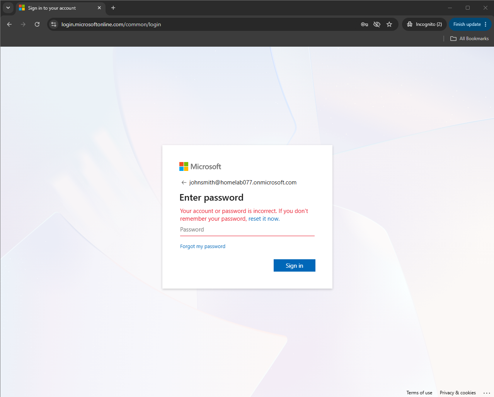

### User Credential Reset Process

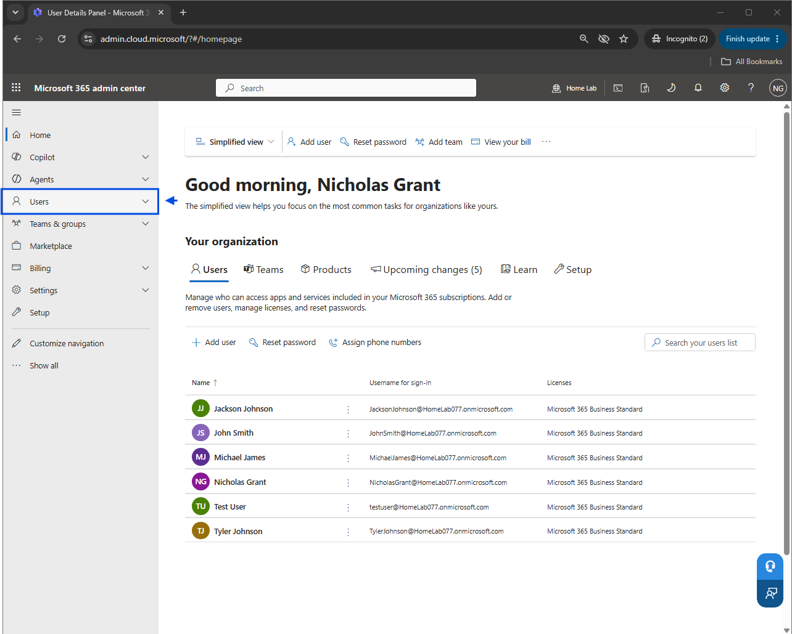
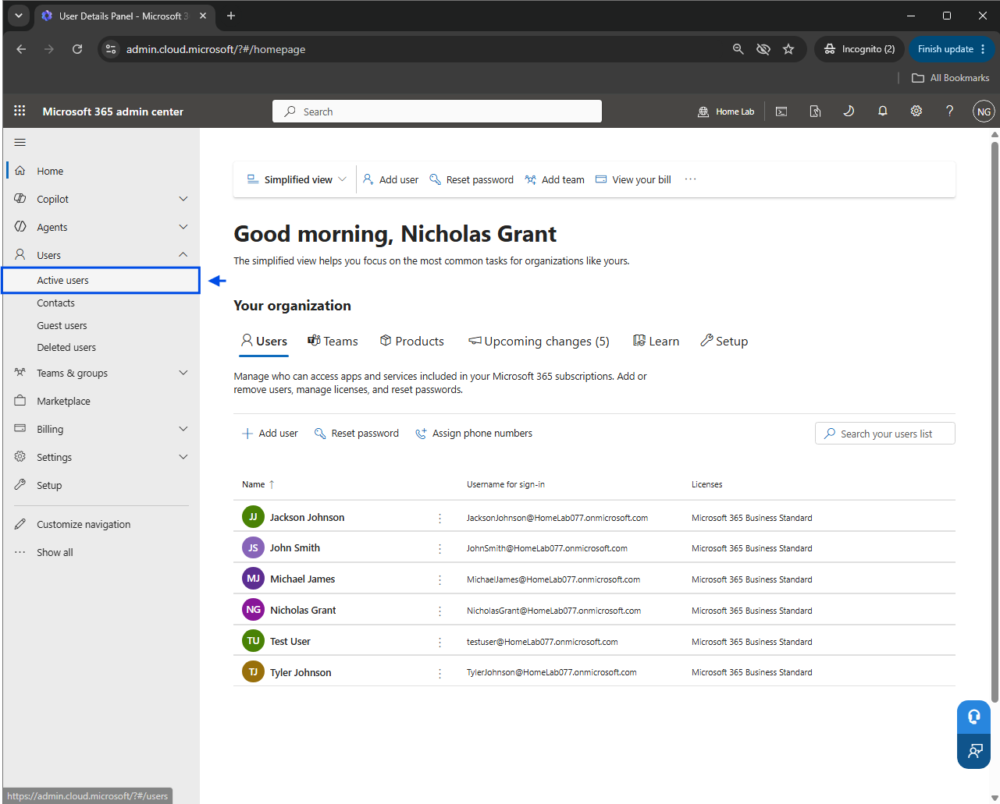
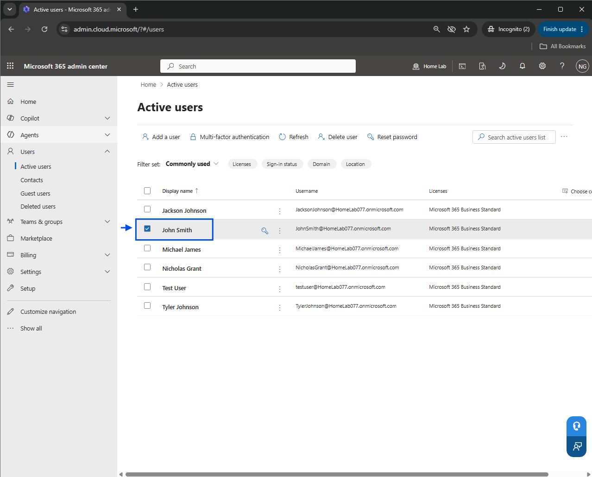
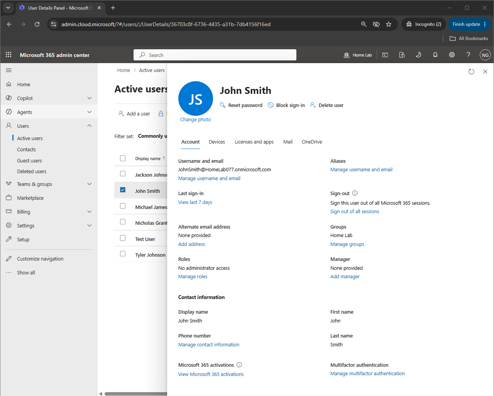
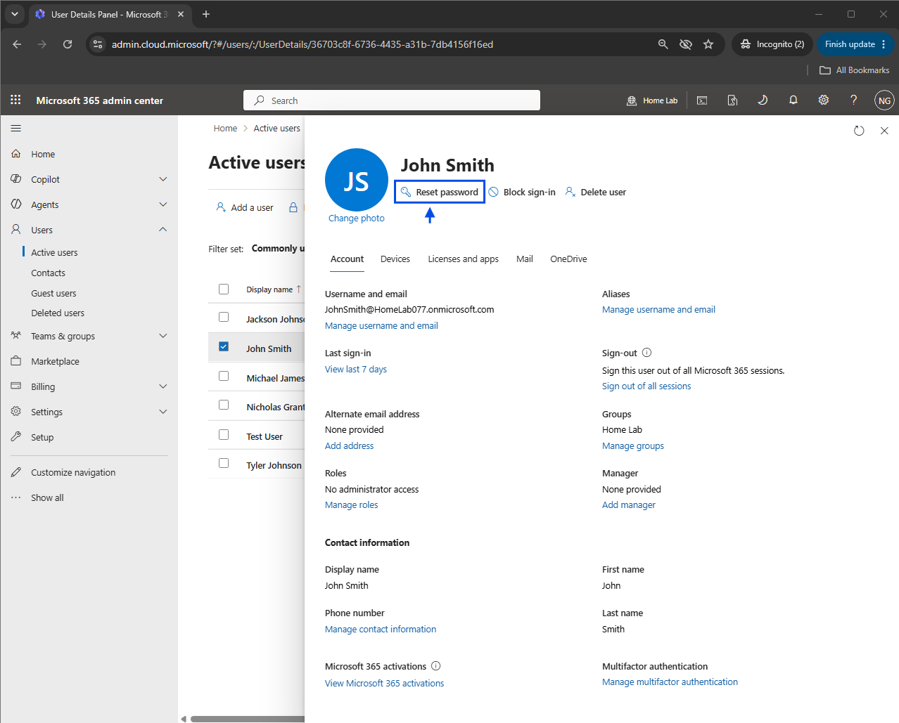

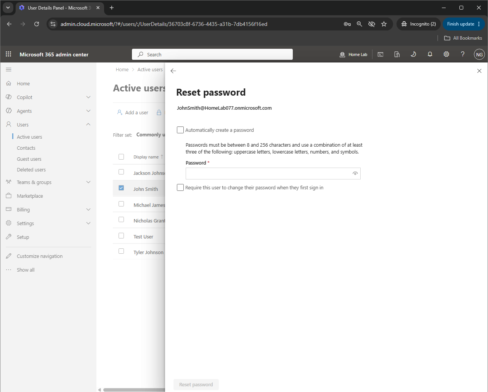
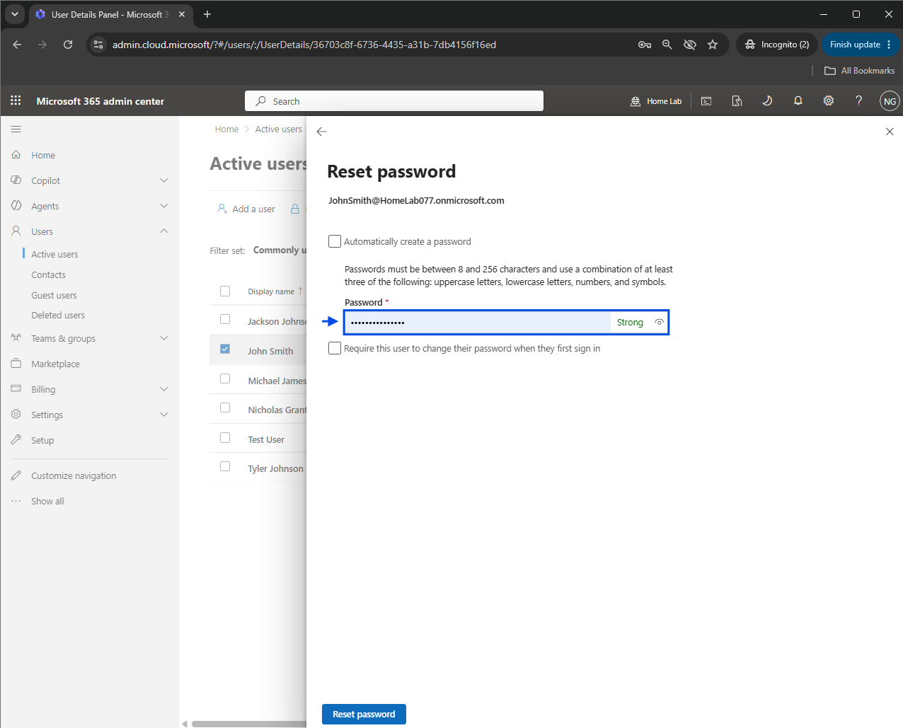
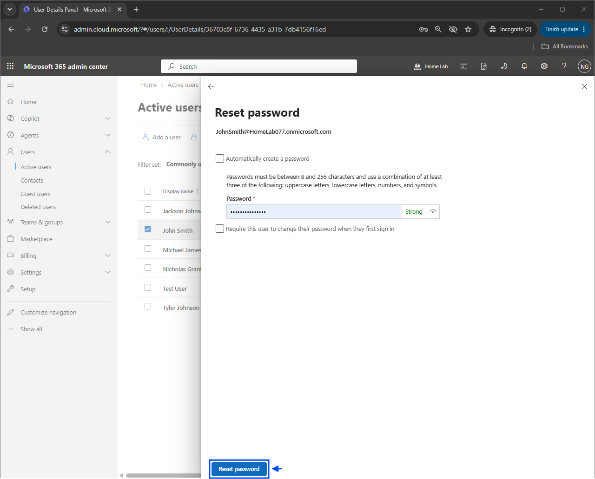
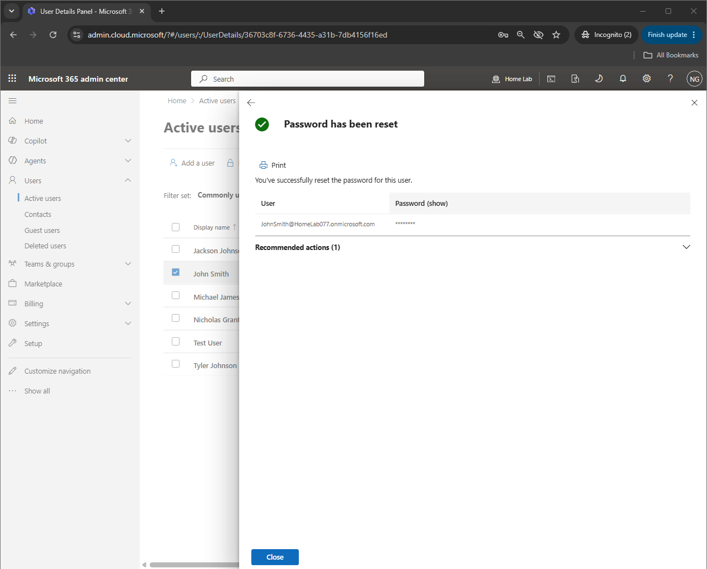

### Validation Process

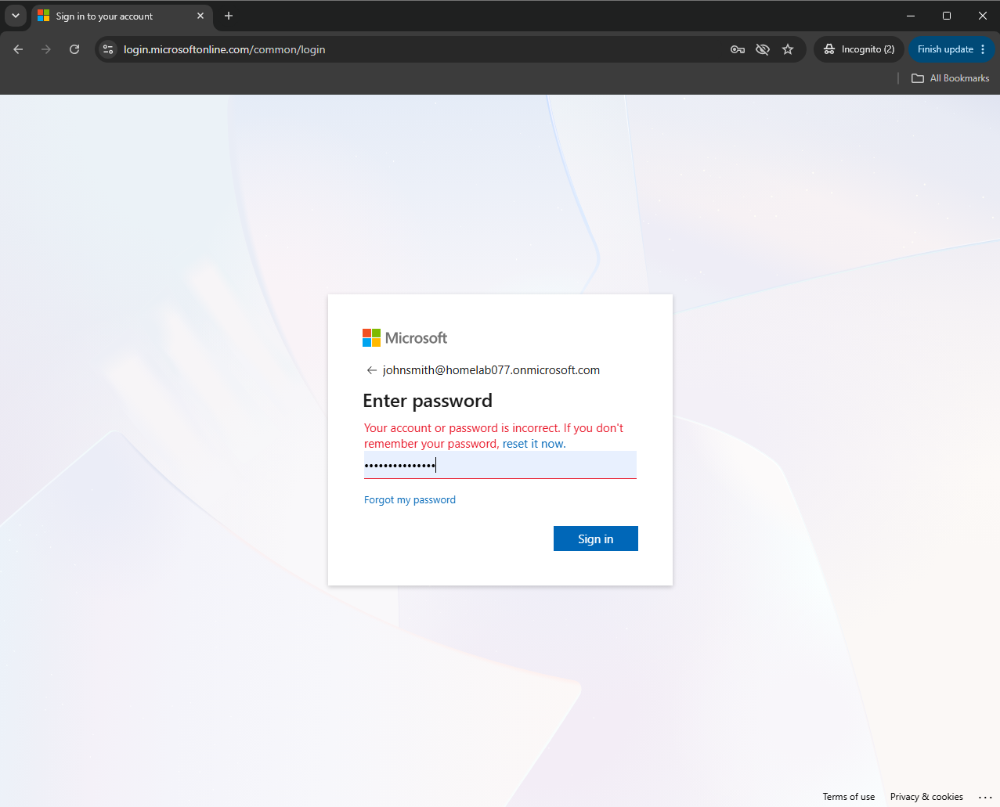
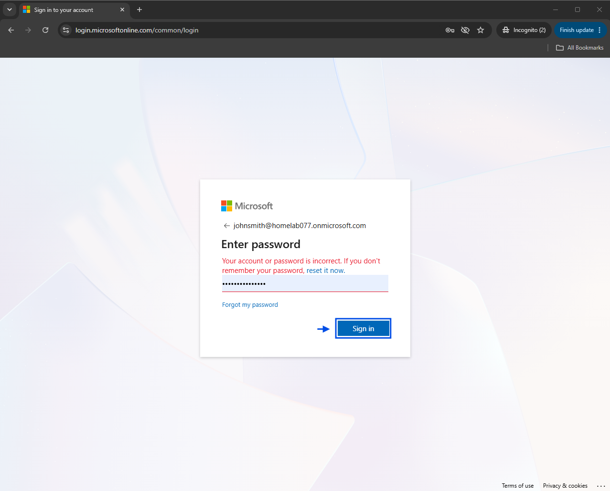
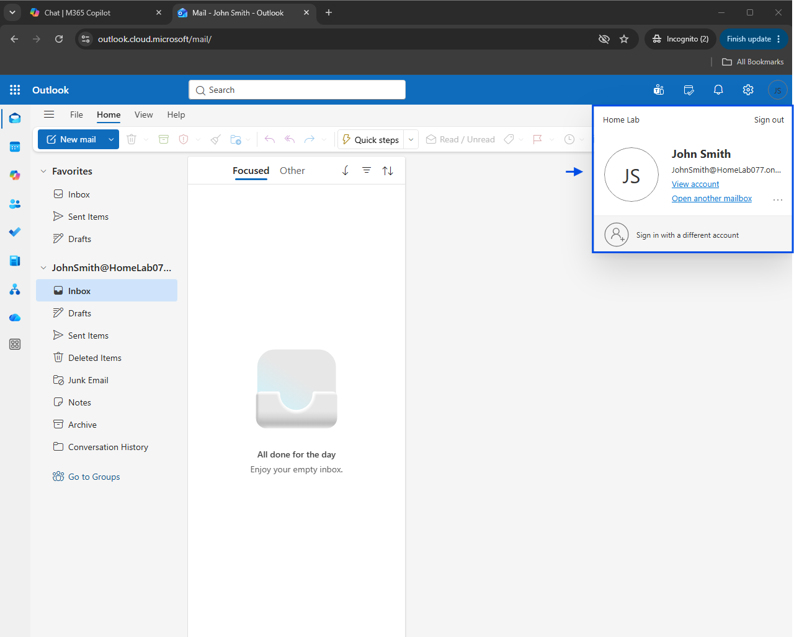
