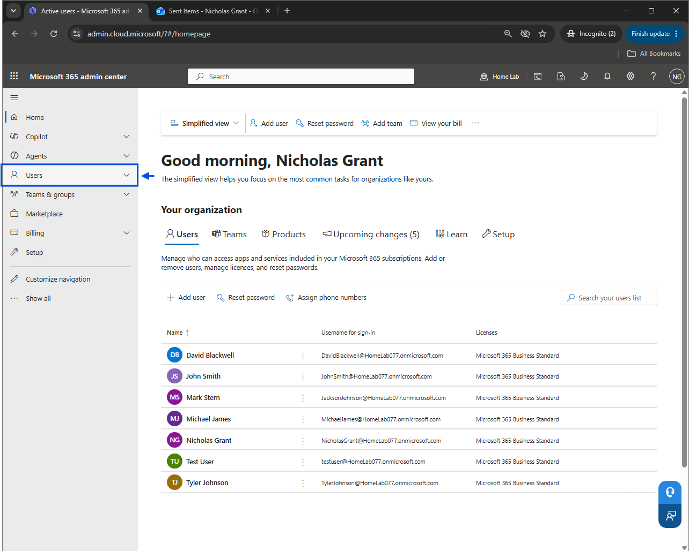
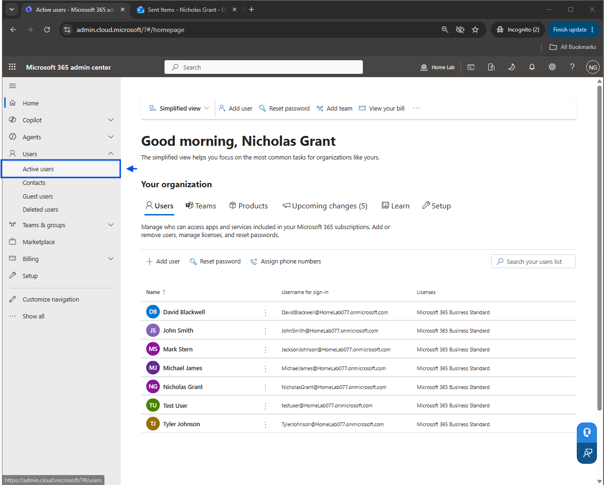
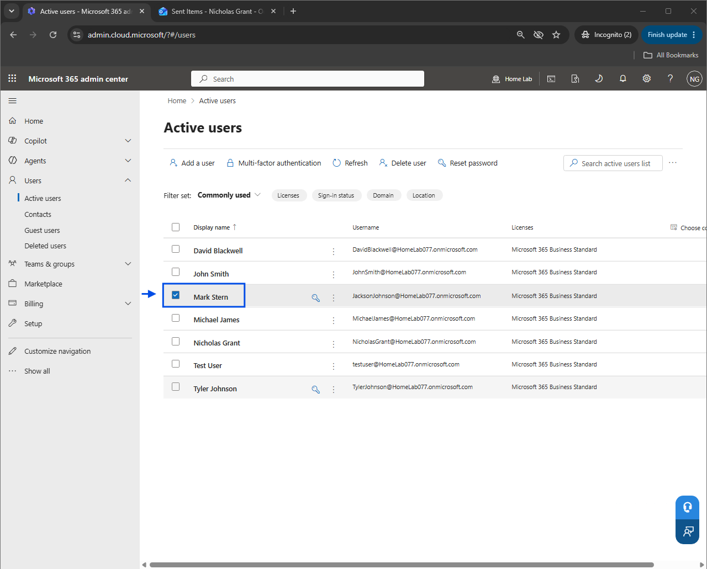
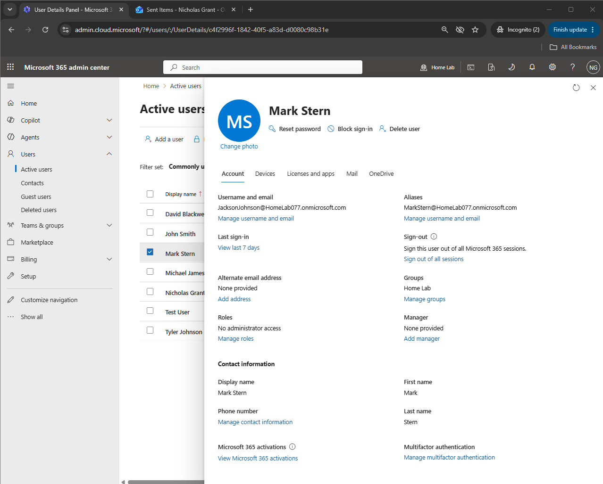
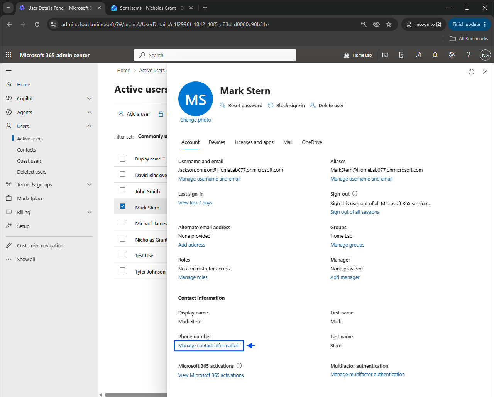
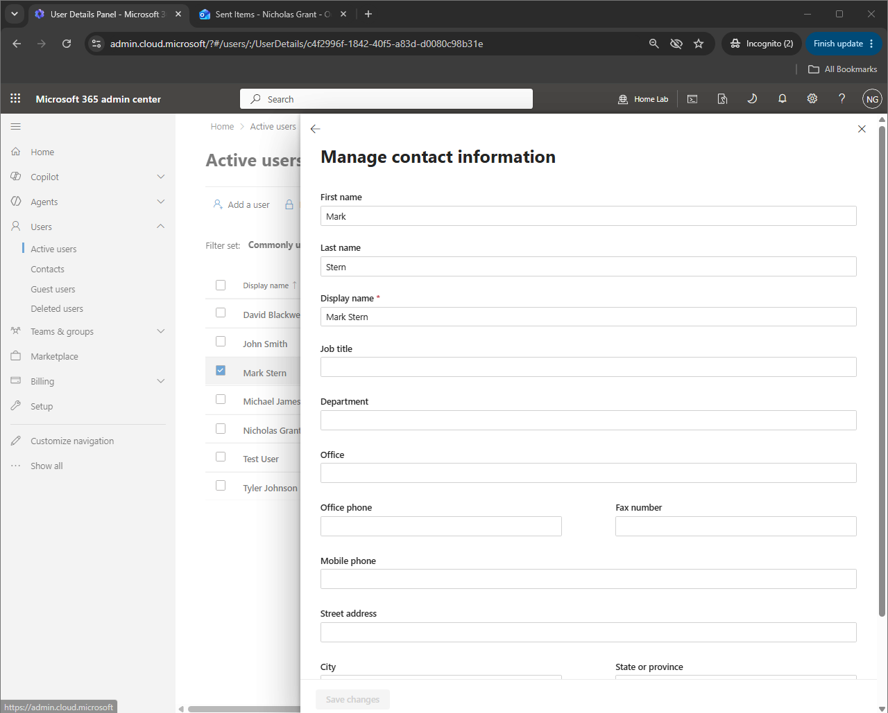
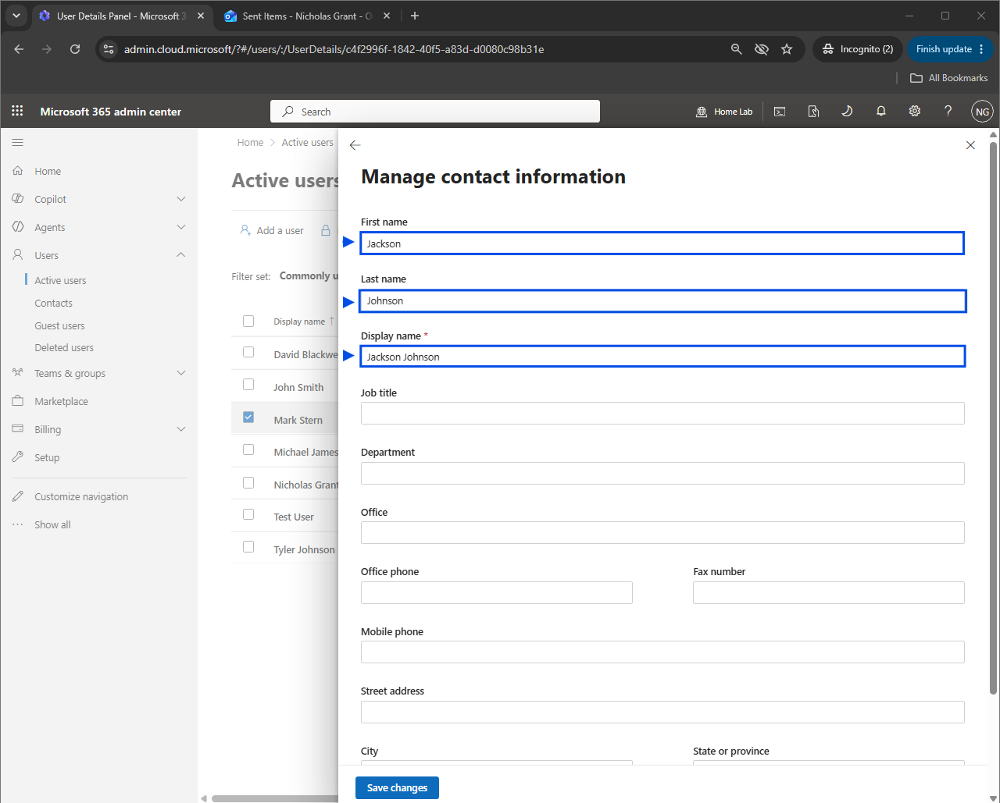
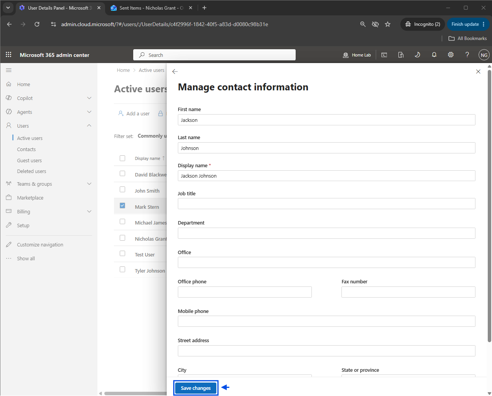
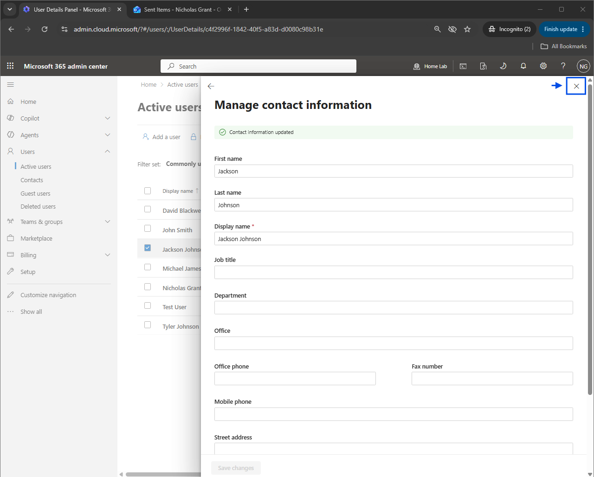
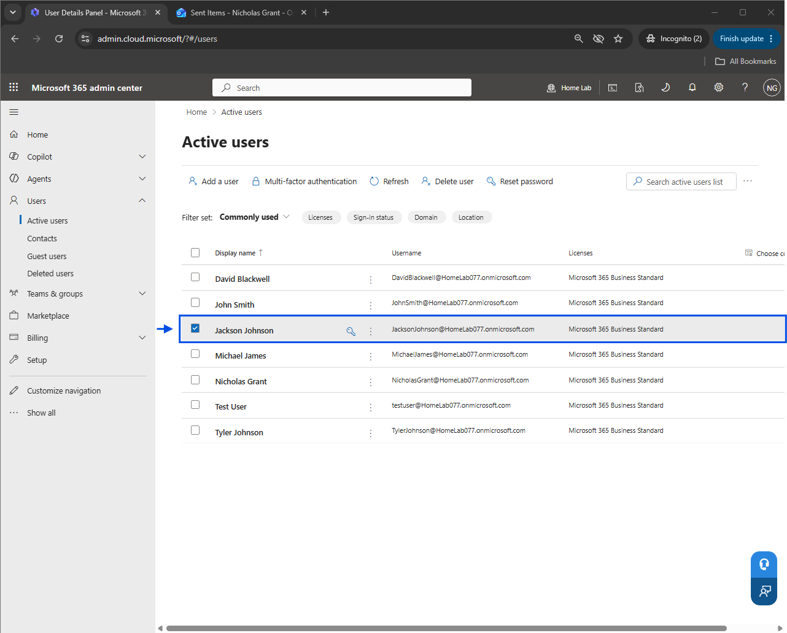

# User Identity Modification

## Overview
Demonstrated hands-on experience modifying user profile information through the Microsoft 365 Admin Center. This process involved accessing user contact information settings, updating the user’s first name, last name, and display name, saving administrative changes, and validating the updated account information within the Active Users directory.

This project demonstrates practical experience with Microsoft 365 user profile management, identity record modification, and administrative validation in a cloud-based identity management environment.

---

## Environment / Tech Stack
- Microsoft 365 Admin Center
- Microsoft Entra ID
- User Account Administration
- Identity and Access Management (IAM)
- User Profile Management

---

## User Profile Administration
- Accessed **Active Users** within Microsoft 365 Admin Center
- Selected an existing user account
- Opened **Manage Contact Information**
- Modified the user’s first name, last name, and display name
- Validated updated profile information in the Active Users directory

---

## Key Skills Demonstrated
- Microsoft 365 Administration
- User Profile Management
- User Identity Administration
- Identity and Access Management (IAM)
- Cloud User Administration
- Account Modification Management
- Administrative Change Validation

---

## Key Takeaways
Managing user profile information is a fundamental administrative function within identity management. Accurate user record updates support organizational consistency, account standardization, and proper user lifecycle management across cloud-based environments.

---

## Screenshots

### User Identity Modification Process

