# User Email Address Modification

## Overview
Demonstrated hands-on experience modifying a user’s email address configuration through the Microsoft 365 Admin Center. This process involved accessing user identity settings, updating the primary email configuration, saving administrative changes, and validating the updated user identity within the Active Users directory.

This project demonstrates practical experience with Microsoft 365 user identity management, account modification, and administrative validation in a cloud-based administrative environment.

---

## Environment / Tech Stack
- Microsoft 365 Admin Center
- Microsoft Entra ID
- User Account Administration
- Identity and Access Management (IAM)
- User Identity Configuration

---

## User Identity Administration
- Accessed **Active Users** within Microsoft 365 Admin Center
- Selected an existing user account
- Opened **Manage Username and Email**
- Modified the user’s username and email configuration
- Validated updated user identity information in the Active Users directory

---

## Key Skills Demonstrated
- Microsoft 365 Administration
- User Identity Management
- Email Configuration
- Cloud User Administration
- Account Modification Management
- Administrative Change Validation

---

## Key Takeaways
Managing users' email addresses is a core function of identity administration. Accurate identity modifications support organizational standardization, account consistency, and proper user account lifecycle management across cloud environments.

---

## Screenshots

### User Email Address Modification Process

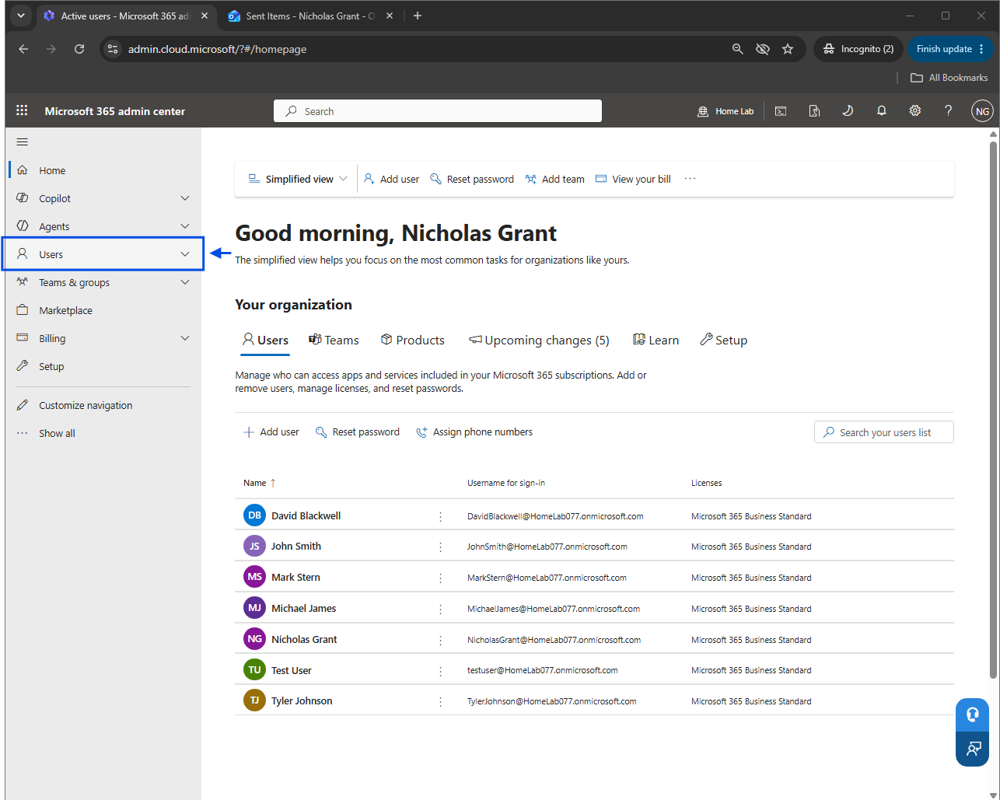
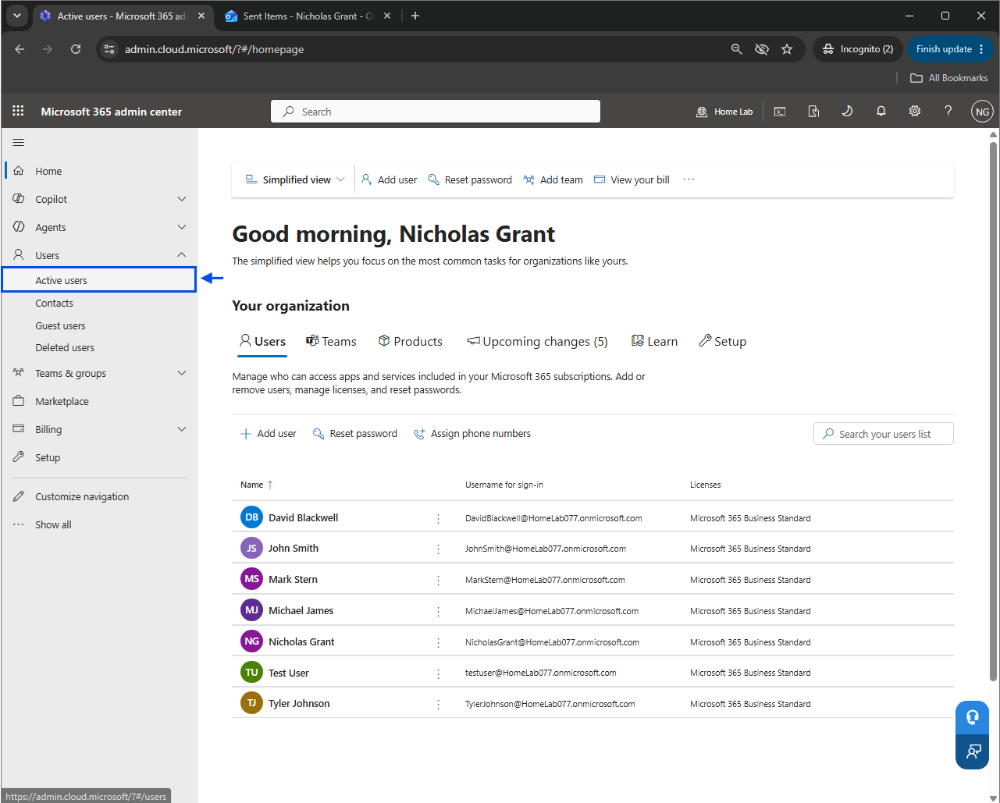
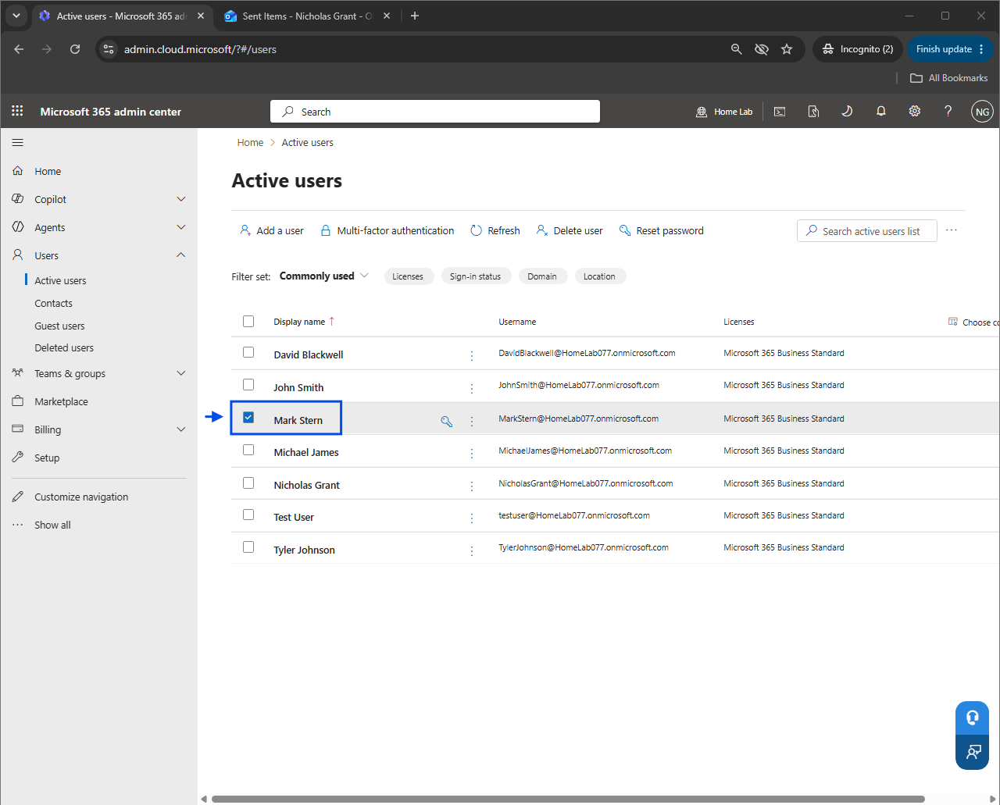
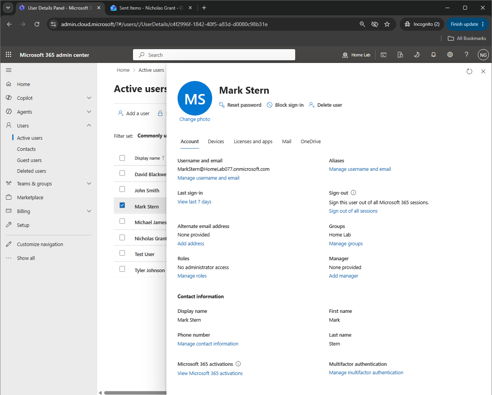
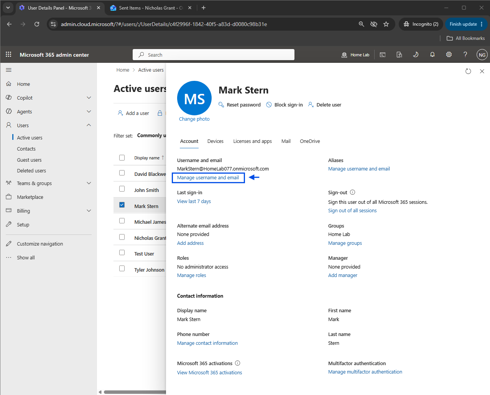
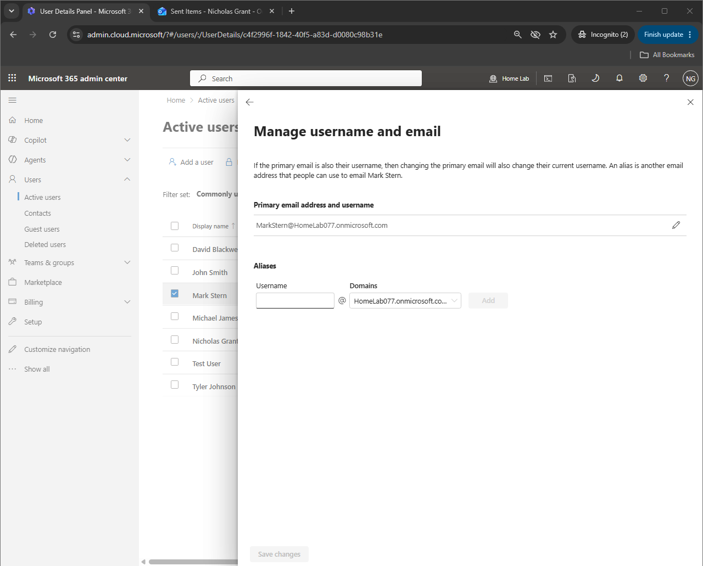
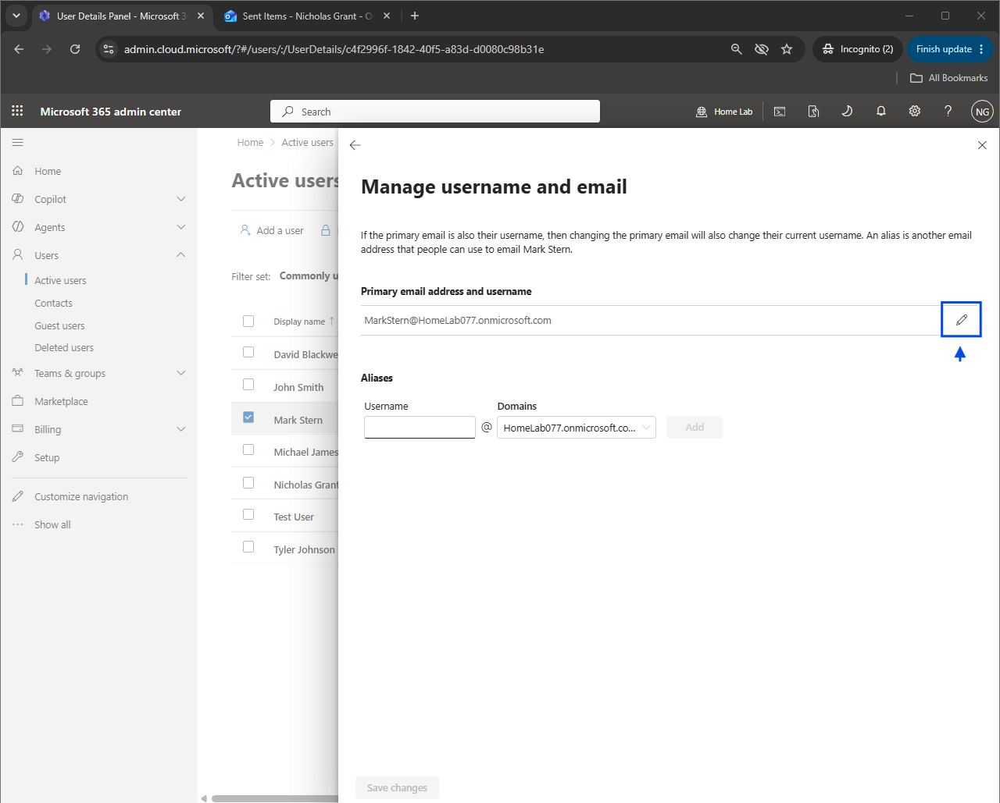
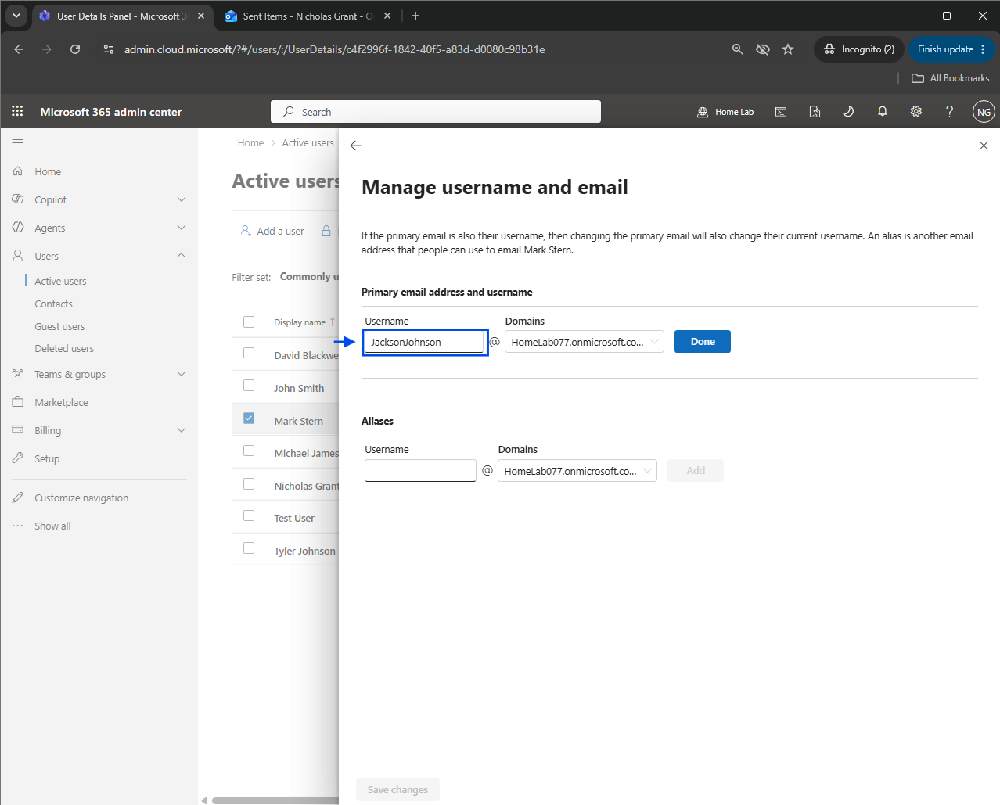
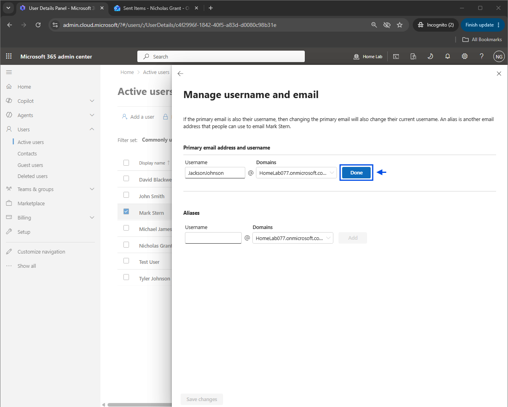
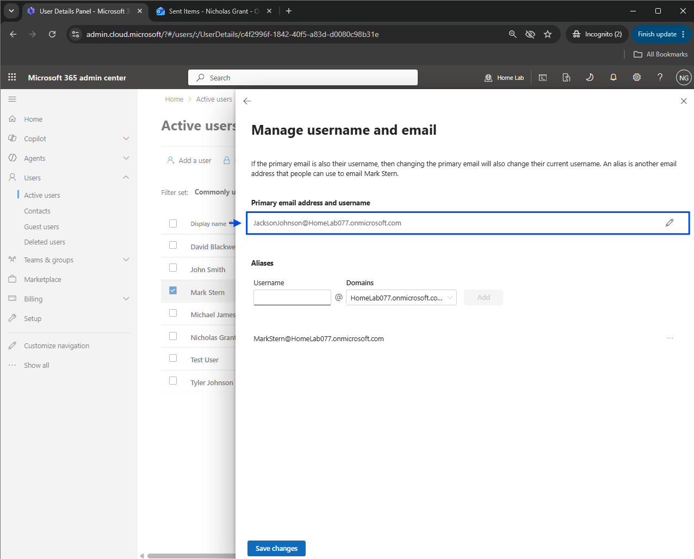
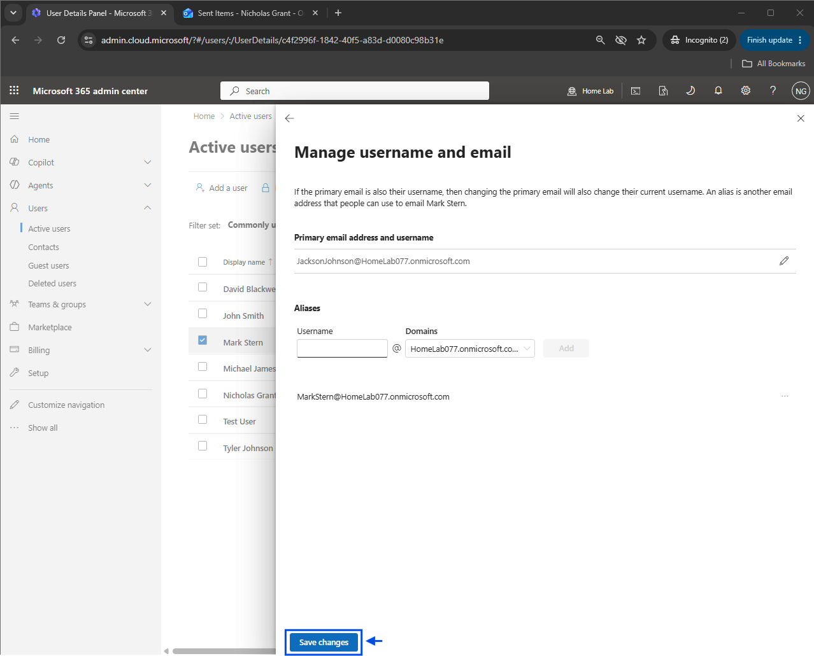
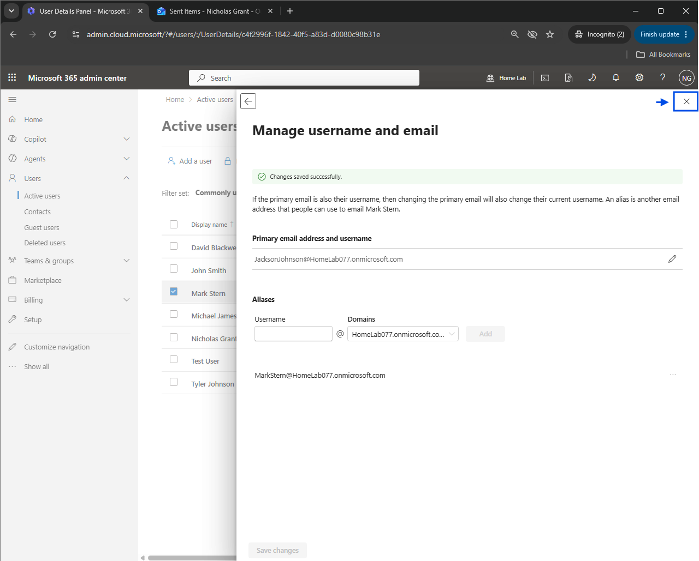
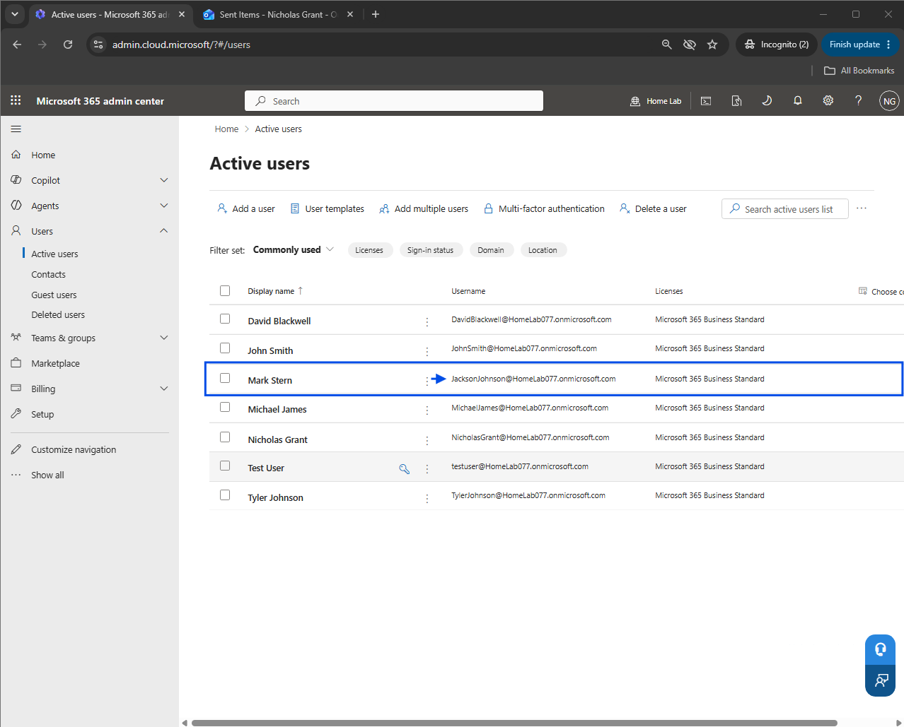
