# User Deprovisioning

## Overview
Demonstrated hands-on experience deleting a user account through the Microsoft 365 Admin Center. This process involved accessing an active user account, initiating the account deletion workflow, and removing the user from the organization’s active directory environment.

This project demonstrates practical experience with Microsoft 365 user deprovisioning, identity lifecycle management, and administrative account removal in a cloud-based identity management environment.

---

## Environment / Tech Stack
- Microsoft 365 Admin Center
- Microsoft Entra ID
- User Account Administration
- Identity and Access Management (IAM)
- User Lifecycle Management

---

## User Deprovisioning Administration
- Accessed **Active Users** within Microsoft 365 Admin Center
- Selected an existing user account
- Initiated the **Delete User** workflow
- Removed the user account from the active directory environment
- Validated successful account removal from the Active Users directory

---

## Key Skills Demonstrated
- Microsoft 365 Administration
- User Deprovisioning
- Identity Lifecycle Management
- Identity and Access Management (IAM)
- Account Removal Administration
- Cloud User Administration
- Administrative Change Validation

---

## Key Takeaways
User deprovisioning is a critical administrative function in identity management. Proper account removal supports access control, organizational security, and structured user lifecycle management by ensuring inactive or unnecessary accounts are removed from the environment.

---

## Screenshots

### User Deprovisioning Process

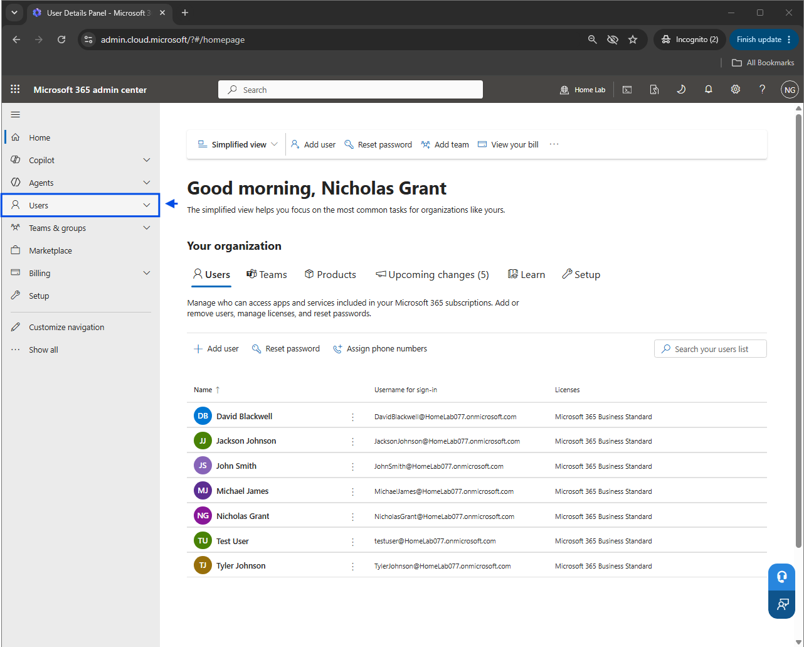
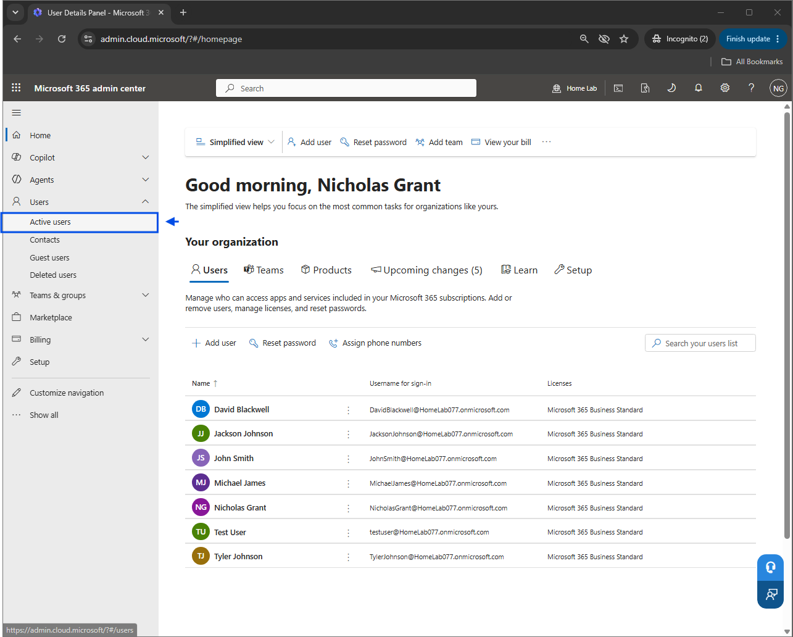
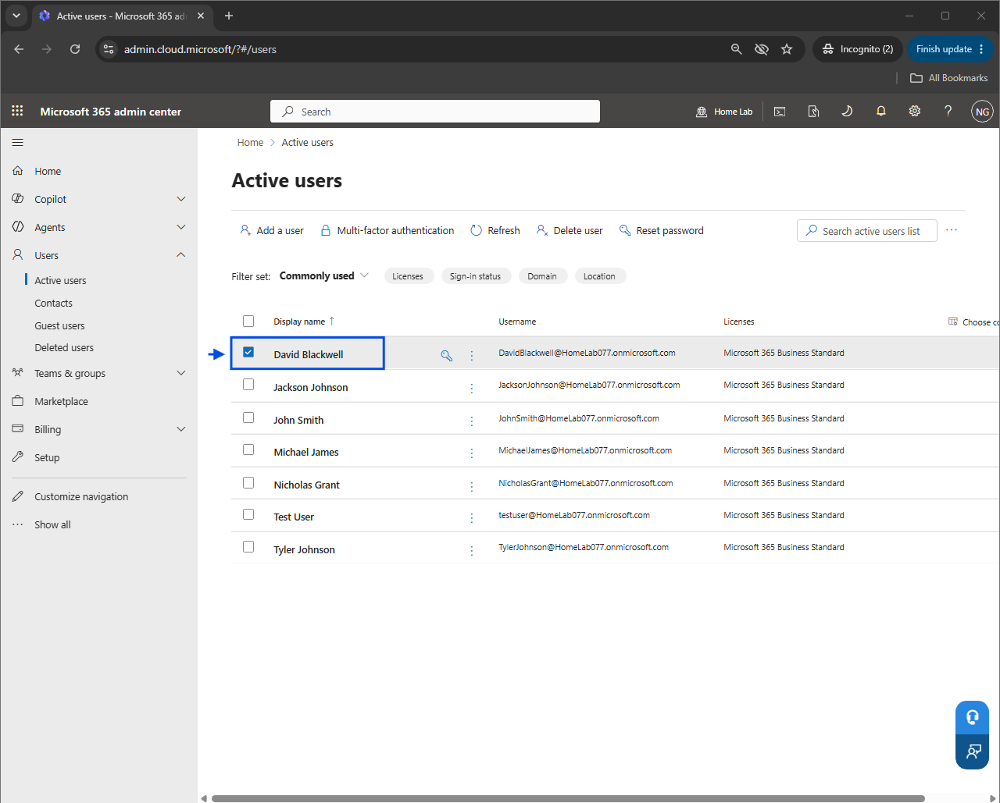
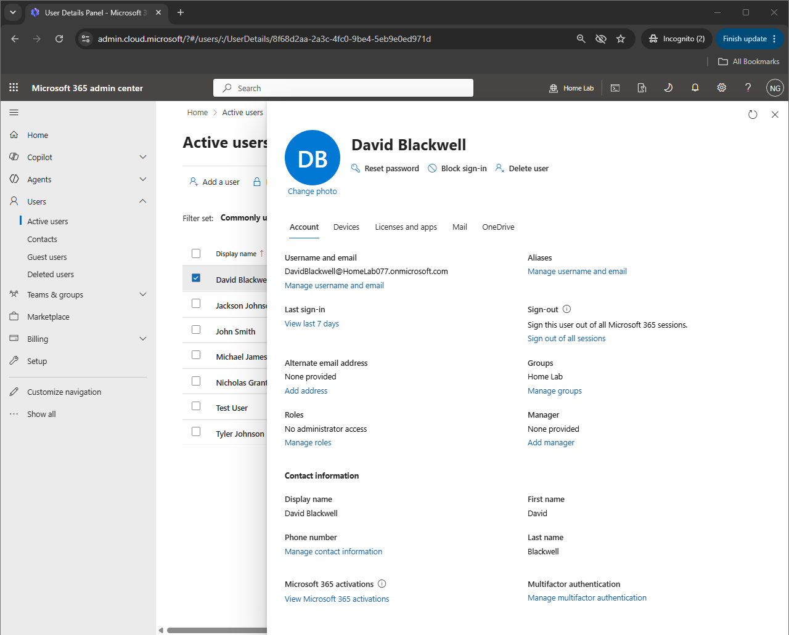
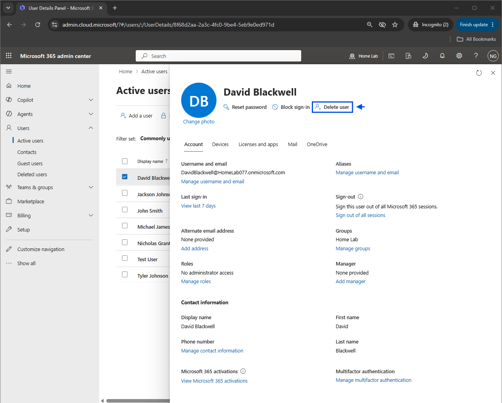
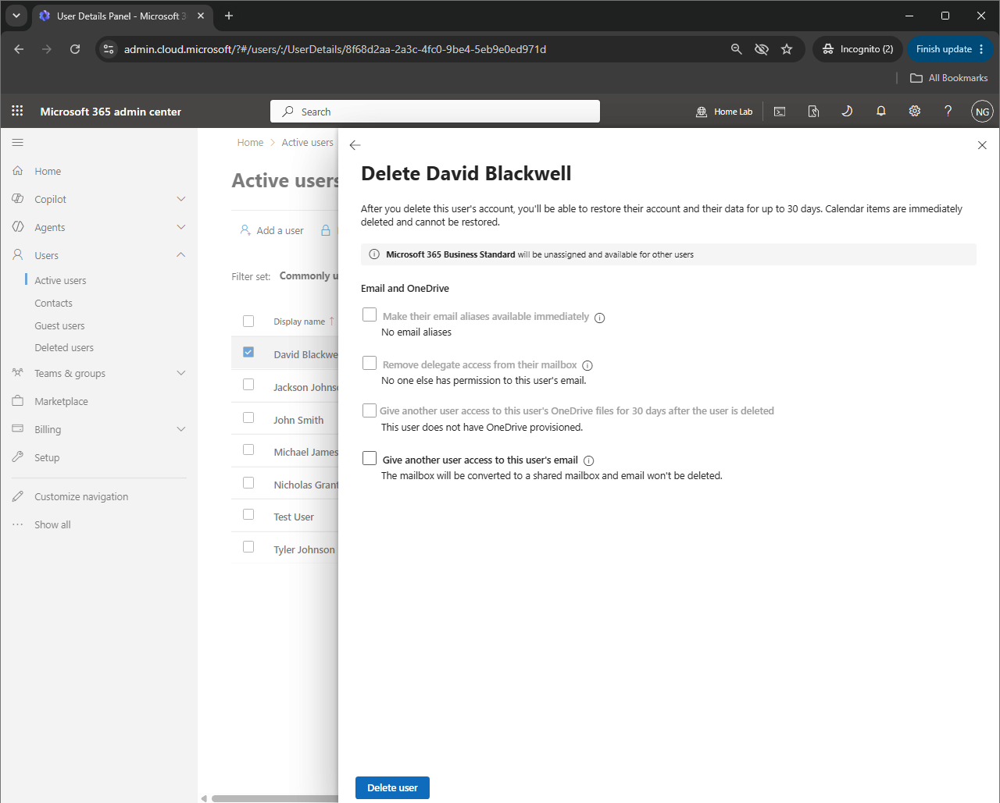
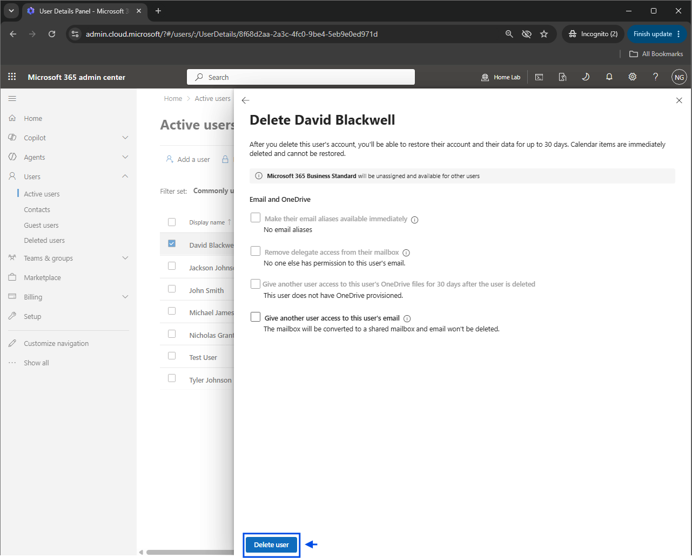
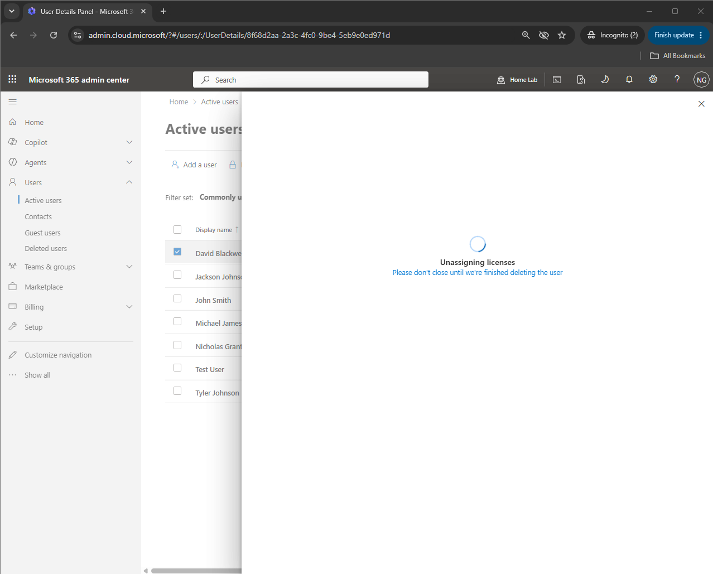
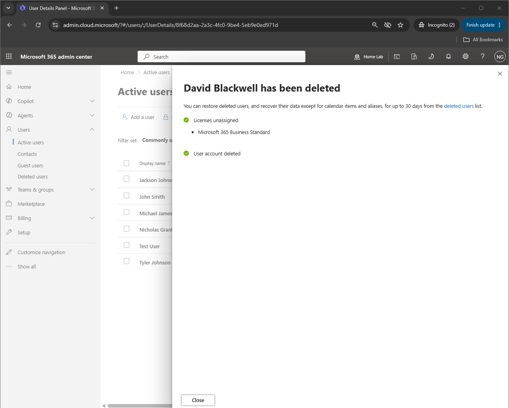
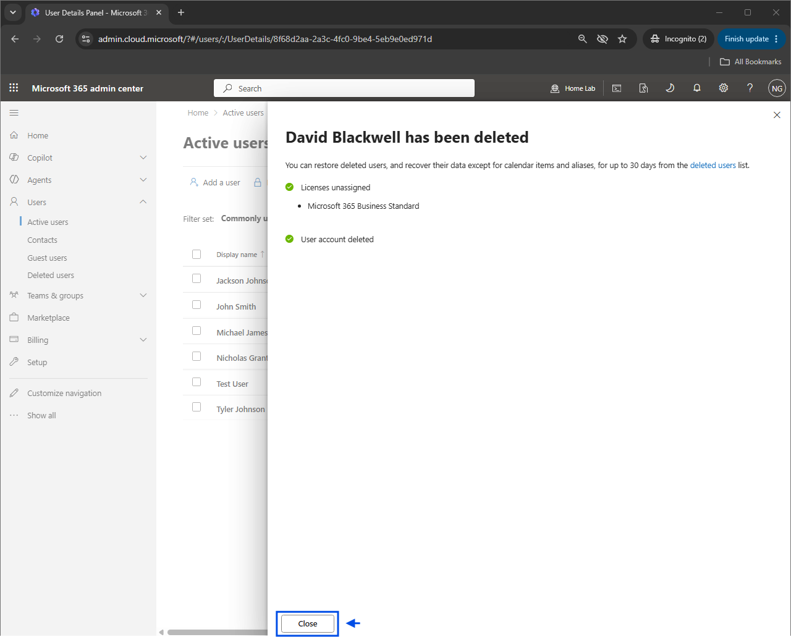
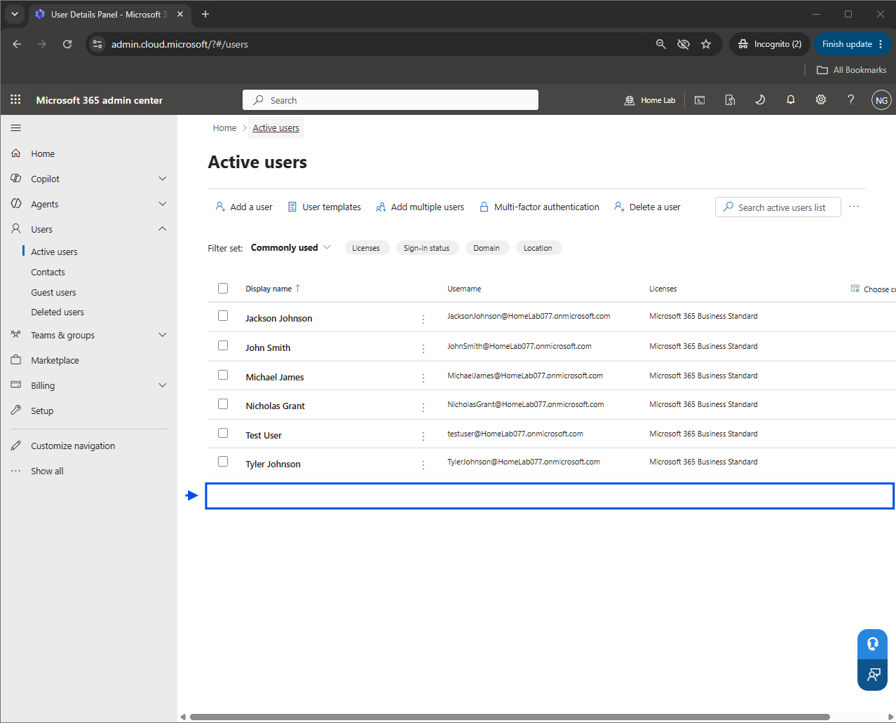
